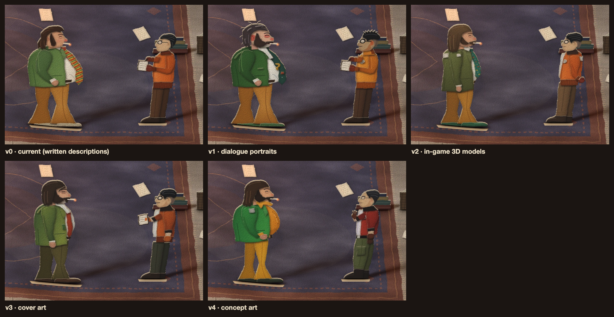
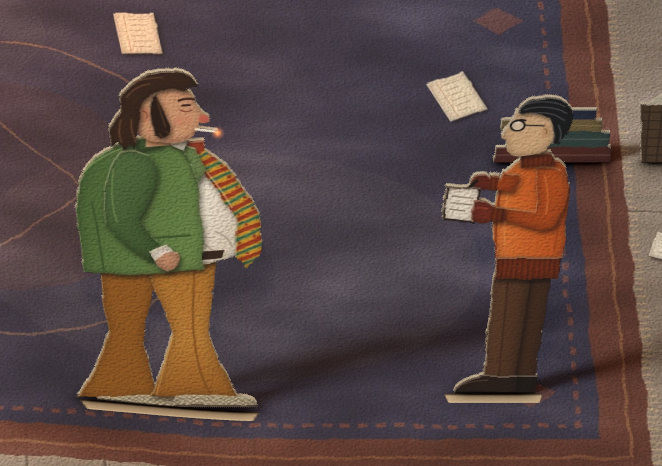
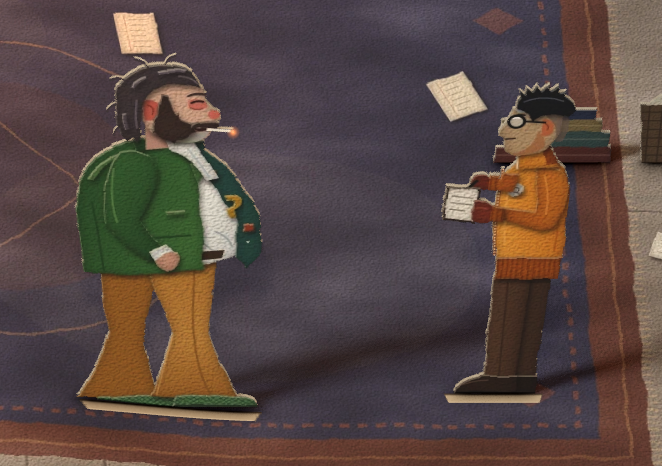
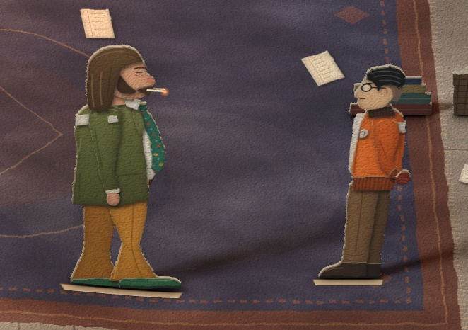
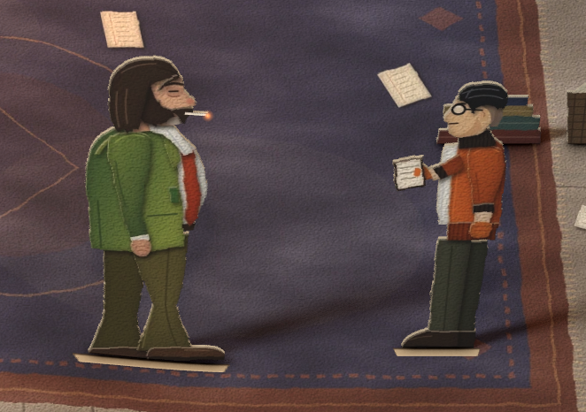
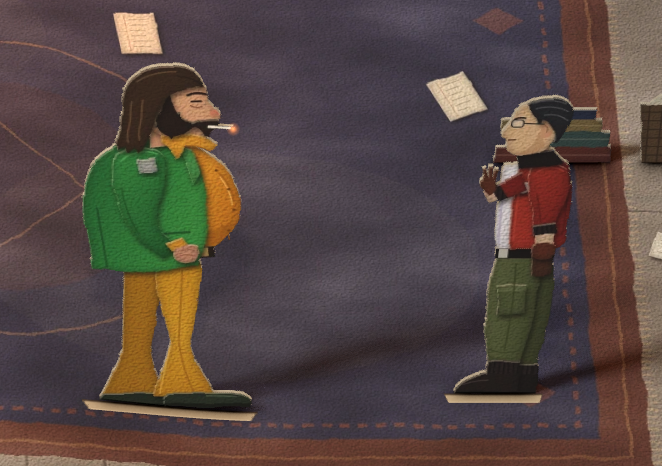

# 纸偶的多个版本

哈里与金的纸偶按原作的四类图片各画了一版（v1–v4），与现有版本（v0）并存，用页面参数 `?cast=N` 切换。v0 在无法访问图片站点的环境里按文字资料绘制（`docs/design.md` 6.4 节），没有对照过原作图片。

## 查看与实现

- 页面参数：`?cast=1` 至 `?cast=4` 选择版本，不带参数为 v0。可与其他参数组合，例如 `?still&cast=2`、`?lang=en&cast=3`。
- 源文件：`assets/art/harry-vN.svg`、`assets/art/kim-vN.svg`；v0 为 `harry.svg`、`kim.svg`，未改动。
- 与 v0 相同的部分：纸片滤镜 `cutS`（切边、纸纹、烧边）、朝向（哈里朝右，金朝左）、大小（金的身高约为哈里的九成）、根元素的 `data-*`（脚底 `soles`、立脚范围 `feet-x0/x1`、哈里的烟头位置 `ember-x/y`）。两人的站位与 v0 相同。
- 加载：`src/main.ts` 只加载选中的一版纸偶纹理，在 `loadArt` 之后把 `art.harry`、`art.kim` 指向 `harry-vN`、`kim-vN`。纸偶、立脚、卡纸厚度、悬停提示的透明度拾取、烟头光点、开场翻起与结尾离场都使用这一对纸片。版本不存在时控制台给出警告并显示 v0。
- 烘焙：`npm run bake harry-v1 kim-v1 …`。
- 对比图：`node tools/cast.mjs`（先构建；`--no-build` 跳过构建）在 `?still` 静帧里以 2 倍分辨率渲染每一版，按同一范围裁出两个纸偶，写 `docs/cast-v0.png` 至 `docs/cast-v4.png` 与拼图 `docs/cast-sheet.png`。

## 对比

| 版本 | 参考 | 哈里 | 金 |
|---|---|---|---|
| v0 | 文字资料 | 及领乱发、两道大鬓角、无胡子；草绿西装；黄、红、青斜条纹领带；金褐色喇叭裤；浅色蛇皮鞋 | 黑发后梳、小圆眼镜；橙色夹克配深色罗纹领、袖口与下摆；双手持笔记本和笔；棕色长裤 |
| v1 | 对话肖像 | 灰棕乱发翘起几缕；络腮连鬓胡连着大胡子，咧嘴笑，下巴灰色胡茬；眼圈与鼻头泛红；超大白色尖领；深青绿领带带黄色钩形图案；墨绿西装 | 短发竖起成刺、两侧剃短；粗黑圆框眼镜；细胡子；暖橙色高立领夹克、银色拉链、胸前白色圆徽章 |
| v2 | 游戏内 3D 模型 | 浅棕直长发垂到领口；橄榄绿长西装，背上与上臂各一块白色贴片；赭黄喇叭裤；绿色鞋；青绿底花纹领带 | 黑色短发、后颈剃短；橙色夹克配深棕针织领，背上白色贴片，胸前白色圆徽章；双手背在身后；红棕手套；卡其棕长裤收进深棕短靴 |
| v3 | 封面画 | 深色长发过耳，额前垂一缕；马蹄形大胡子连着络腮鬓；白衬衫大领敞开；锈红领带松垂；绿色西装，亮处泛黄绿；深橄榄色长裤 | 黑发侧分后梳；粗黑圆框眼镜；焦橙色夹克敞开，白 T 恤，深色针织领与黑色罗纹袖口，袖子推到小臂；棕黄驾驶手套；深灰绿长裤；一手握拳，一手拿笔记本 |
| v4 | 设定图 | 肚子圆而高、胸厚臂粗、腿细长；波浪长发到肩、大胡子；亮绿西装，上臂灰色贴片；芥末色衬衫的大领立起；黑腰带；芥末色喇叭裤；握拳 | 发际线后退、头发抹油后梳、大耳朵、细框小眼镜；酱红夹克敞开，黑色平领，袖子推到小臂；白色 V 领 T 恤、胸前白色圆标；黑腰带与枪套；棕手套；橄榄色宽松工装裤，大腿口袋，收进黑靴；一手抬在胸前 |

## 参考图

参考图只以外链出现在本文档，仓库不保存副本。纸偶全部为手绘的剪纸图形，没有描摹或嵌入原作图片。

discoelysium.wiki.gg 的图片拒绝 GitHub 的图片代理，在 GitHub 上可能不显示，点来源链接查看。Steam 与维基百科的图片可以显示。

另外查看过、未单独成版的图片：

- [Steam 截图（黎明街道）](https://shared.akamai.steamstatic.com/store_item_assets/steam/apps/632470/ss_1733c149b614b835785ef48c2468b1e215f5c1ef.1920x1080.jpg)：金的正面，橙色夹克、深色领、胸前白色圆徽章、上臂白色贴片、白 T 恤、卡其色长裤。哈里在这张图里穿另一套衣服（棕色西装、礼帽）。用于 v2。
- [Steam 截图（审判场景）](https://shared.akamai.steamstatic.com/store_item_assets/steam/apps/632470/ss_0813f92720c59a5d21ed2d3291b8156bb4cb0fc8.1920x1080.jpg)：金的侧面，夹克罗纹下摆、红棕手套、卡其色长裤收进靴子。用于 v2。
- [恐怖领带的物品图](https://discoelysium.wiki.gg/images/Neck_tie_big.png)（[来源页](https://discoelysium.wiki.gg/wiki/Horrific_Necktie)）：宽领带，青绿底，印有黄色齿轮形、橙红方块、白色星形等图案。用于 v2 的领带。
- [两人的 3D 雕刻稿](https://discoelysium.wiki.gg/images/Kim-3d-somelar.png)（Rauno Somelar，按设定图制作，未上色；[哈里](https://discoelysium.wiki.gg/images/Harry-3d-somelar.png)）：金的高立领、罗纹袖口与下摆、工装裤收进系带靴；哈里的宽驳领西装与领带。用于核对 v2 的服装结构。
- Steam 点数商店的动态贴纸（[哈里](https://shared.akamai.steamstatic.com/community_assets/images/items/632470/3582695bba6d57b443dc5ff3daf3786e9fcf4d66.png)、[金](https://shared.akamai.steamstatic.com/community_assets/images/items/632470/34d01939d27d8bd3fce43ef0fd0e712201fd8058.png)）：官方的扁平卡通造型，哈里系红领带、穿绿鞋，金穿橙色夹克与棕色长裤。尺寸只有 150 像素，未单独成版。

## v0：现有版本

- 依据：`docs/design.md` 6.4 节的文字描述，没有参考图。
- 与参考图的出入：
  - 哈里没有胡子。肖像、封面与设定图中，哈里都有八字大胡子，两侧鬓角连成络腮胡。
  - 领带是黄、红、青斜条纹。物品图与肖像中的恐怖领带是青绿底加零散图案；封面画与 Steam 贴纸中是锈红色领带。
  - 鞋是浅色蛇皮鞋。游戏模型中是绿色鞋。
  - 金的夹克领口、袖口与下摆都是深色罗纹。游戏模型中领口深棕、下摆与夹克同为橙色系；肖像中是橙色高立领。

## v1：对话肖像

**参考**

- 哈里的对话肖像（「神情」版，咧嘴笑）：[discoelysium.wiki.gg · Harry Du Bois](https://discoelysium.wiki.gg/wiki/Harry_Du_Bois)

  

- 金的对话肖像：[维基百科 · Kim Kitsuragi](https://en.wikipedia.org/wiki/Kim_Kitsuragi)（较大尺寸见 [wiki.gg](https://discoelysium.wiki.gg/images/Kim-portrait.png)）

  

- 游戏界面中的同一对肖像（左下角）：[Steam 截图](https://shared.akamai.steamstatic.com/store_item_assets/steam/apps/632470/ss_b3694e99ffdb686d1bbbbe16a540d3d2ccd509c4.1920x1080.jpg)，[Steam 商店页](https://store.steampowered.com/app/632470/Disco_Elysium__The_Final_Cut/)

  

**图片内容**：对话时出现的半身油画肖像。哈里的背景是橙、青、白色斜条，金的背景是深棕底上的白色圆形。

**取用**

- 画法：头部比例放大约 10%；肖像里成块的颜色做成分开的纸片，例如哈里脸上的灰绿阴影、眼圈与鼻头的红晕，金额头的冷蓝色高光、下颌的橙褐阴影。
- 哈里：深灰棕乱发向后拢，夹着几道浅灰紫发丝，头顶和脑后翘起几缕；两侧鬓角连成络腮胡，接上浓密的八字胡；咧嘴露出上排牙；下巴是灰色胡茬；大耳朵发红；上眼睑沉重，眼下有红色眼袋；衬衫领尖很长，压在西装驳领上，领口里是蓝灰色阴影；领带为深青绿色，带黄色钩形图案和锈红色小块；西装为墨绿色，亮处有浅绿笔触。
- 金：黑色短发在头顶竖起成刺，两侧剃短；粗黑圆框眼镜，镜片上有白色反光；细胡子；大耳朵；暖橙色夹克，高立领竖到下颌，领内是锈红色阴影，银色拉链一直拉到领口；胸前白色圆徽章，印有深色涡形标记。

**肖像以外**：肖像只到胸口。哈里的体形、金褐色喇叭裤与绿色蛇皮鞋，金的持本姿势、手套、长裤与靴子，按 v0 的结构绘制，颜色换成肖像与游戏模型的颜色。

## v2：游戏内 3D 模型

**参考**

- Steam 截图：Whirling-in-Rags 旅馆一楼的餐厅，[Steam 商店页](https://store.steampowered.com/app/632470/Disco_Elysium__The_Final_Cut/)

  

- 补充：「参考图」一节列出的黎明街道、审判场景两张截图，恐怖领带的物品图，3D 雕刻稿。

**图片内容**：等距视角的游戏画面。哈里站在吧台前，背对镜头；金站在左侧，侧身，双手背在身后；吧台后是餐厅经理。

**取用**

- 哈里：个子高、腿长，肚子不明显；浅棕色直长发，从头顶垂到领口，盖住耳朵；橄榄绿西装，衣长过臀，后背偏上一块白色贴片，上臂一块白色小贴片；赭黄色喇叭裤；绿色皮鞋；双手垂在身侧。
- 金：黑色短发，后颈剃短；深棕针织立领；橙色夹克，宽松，下摆是颜色更深的罗纹；后背偏上一块白色贴片；双手在身后相握，戴红棕手套，手套与袖口之间露出浅色小臂；卡其棕长裤，裤脚收进深棕短靴。黎明街道截图补充了正面：圆框眼镜、胸前白色圆徽章、敞开的前襟里的白 T 恤。

**截图以外**：截图看不到哈里的正面。衬衫为白色，领带按物品图画成青绿底、黄色齿轮形、锈红方块、白色星形的印花。脸与 v0 的轮廓相同，加上八字胡与络腮鬓（依据肖像与雕刻稿）。

## v3：封面画

**参考**

- 《极乐迪斯科：最终剪辑版》的封面（与原版海报是同一幅画）：[Steam 游戏库封面](https://shared.akamai.steamstatic.com/store_item_assets/steam/apps/632470/library_600x900_2x.jpg)；原版海报见[维基百科 · Disco Elysium](https://en.wikipedia.org/wiki/Disco_Elysium)

  

**图片内容**：油画风格的半身像，背景是橙黄色的天空与一座骑马雕像。哈里在右前方，端着霰弹枪；金在左后方，举着手枪，另一只手握拳。画面到大腿为止。

**取用**

- 哈里：胸膛宽厚，肚子不突出；深色长发从中缝分开，垂过耳朵，额前垂下一缕；马蹄形大胡子，两端垂到下颌，接上络腮鬓；下巴灰色胡茬；白衬衫，超大的领子敞开；锈红色领带拉松，领结落在胸口；绿色西装，亮处泛黄绿，暗处深绿；深橄榄色长裤；垂下的手握拳。
- 金：黑发侧分，向后梳，两侧剃短；粗黑圆框眼镜；细胡子；额头一抹冷蓝色高光；焦橙色夹克敞开，里面是白 T 恤；深色针织领；黑色罗纹袖口，袖子推到小臂，露出浅色手臂；棕黄色皮质驾驶手套；深灰绿长裤；靠近观众的手垂下握拳。

**封面以外**：封面里的枪没有画。金另一只手在封面里举着手枪，这里改为拿笔记本（剧本中他多次翻开笔记本）。哈里长裤的下半截与鞋、金的靴子，封面没有画到，按 v0 的形状绘制，喇叭裤口收窄。

## v4：设定图

**参考**

- 哈里的设定图（身体比例与服装）：[discoelysium.wiki.gg · Harry Du Bois](https://discoelysium.wiki.gg/wiki/Harry_Du_Bois)

  

- 金的彩色设定图：[discoelysium.wiki.gg · Kim Kitsuragi](https://discoelysium.wiki.gg/wiki/Kim_Kitsuragi)

  

**图片内容**：哈里一页上有六个形象：侧面裸体线稿、正面与背面的裸体色稿（注释「kinda flabby chest but strong arms」「long thin legs & bulky torso」）、穿绿西装和橙黄衬衫与白色护腿的全身像、一条单独画出的喇叭裤、穿深色细条纹外套与运动裤的全身像。金一页是一幅全身色稿，侧身，一只手抬起。

**取用**

- 哈里：侧面线稿的体形，肚子圆而高、胸口松软、手臂粗壮、腿细长；波浪长发垂到肩，大胡子连着络腮鬓；第四个形象的服装：亮绿西装，上臂灰色条纹贴片，芥末色衬衫的大领竖起压在驳领上，黑腰带；单独画出的芥末色喇叭裤；深色鞋；一只手握拳。
- 金：发际线后退，头发抹油贴着头皮向后梳；大耳朵；细框小眼镜；酱红色夹克敞开，黑色领子平贴，袖子推到小臂，露出黑色罗纹袖口和手臂；白色 V 领 T 恤；胸前白色圆标；黑腰带，胯边挂枪套；棕色手套；橄榄色宽松工装裤，大腿有口袋，小腿处收紧，收进黑靴；一只手抬在胸前，另一只手搭在枪套上。

**设定图以外**：哈里第四个形象的白色护腿（游戏里的装备）没有画，改为深色鞋。设定图是早期方案，与游戏成品有出入：金的夹克在游戏里是橙色，哈里的衬衫在游戏里是白色。

## 建议

建议以 v2 为基础。

- 依据最直接：v2 的参考是游戏内模型的截图，也就是玩家在游戏里一直看到的全身造型，服装颜色、衣长、比例与鞋子都能在截图里核对。v1、v3 的参考只到胸口或大腿，下半身是推测；v4 是早期设定，与成品不一致。
- 画面协调：橄榄绿、赭黄、橙色与卡其色在书房的暖光与紫色地毯上层次清楚，1600 × 900 画面中与 v0 一样容易辨认。
- 姿势有依据：金双手背在身后，与截图中他站在餐厅里的姿势相同。

采用 v2 之前需要决定两点：

- 笔记本：v2 的金手里没有笔记本，而剧本里他几次翻开、合上笔记本（`study.intro`、`study.kim`、`study.recon.5` 等节点），还有一个要他交出笔记本的选项。需要笔记本出现在画面上时，可以换成 v1 的持本姿势。
- 面部：截图看不到正脸，v2 的脸沿用 v0 的轮廓。v1 的面部更接近肖像（哈里的络腮胡、红眼圈与咧嘴笑，金的竖发与粗框眼镜），可以合并进 v2。

v3 可作备选；它的锈红领带与游戏里恐怖领带的样子（青绿底加图案）不同。v4 不建议作为最终形象。

## 待定

- 选定哪一版替换 v0，或者保留 `?cast` 开关。
- 若选 v2：金是否改为拿笔记本；是否换上 v1 的面部。
- 选定后，`docs/design.md` 6.4 节与 3.2、3.3 节的造型描述需要按所选版本更新。
