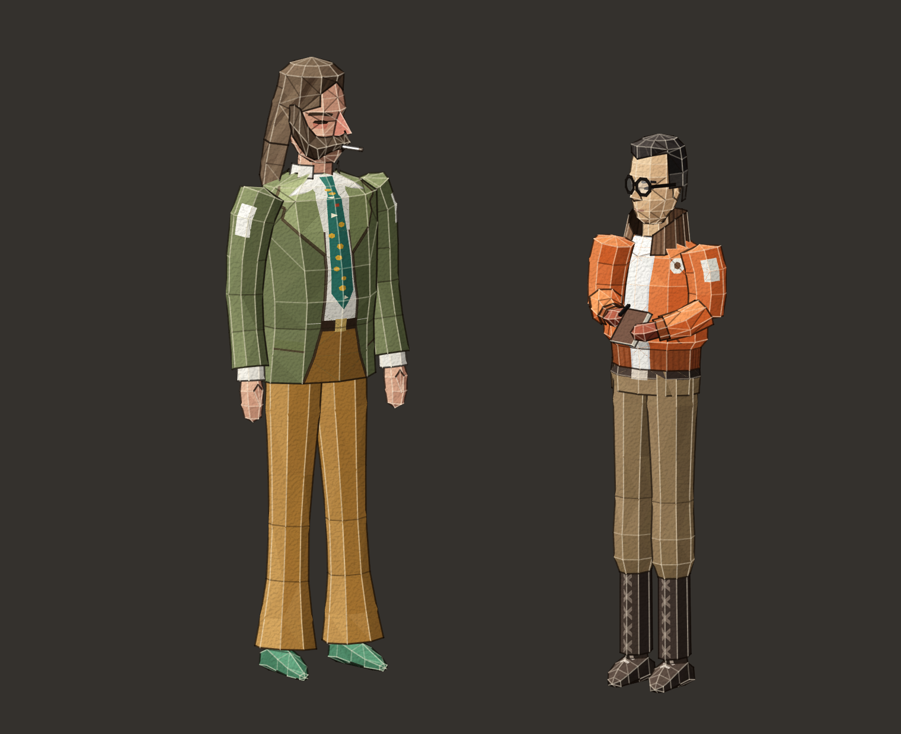
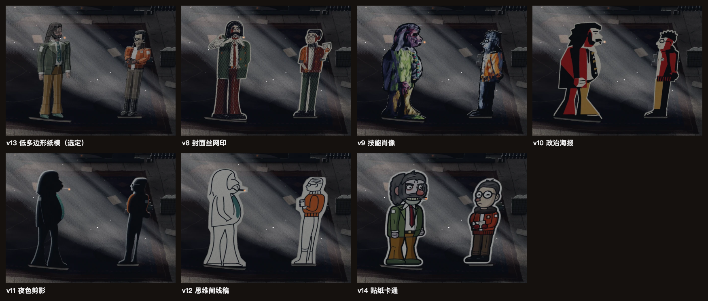

# 纸偶：低多边形纸模型

哈里与金的纸偶是低多边形的纸模型：形体按 Rauno Somelar 为原作做的 3D 雕刻稿，颜色按游戏内模型，平面折面各有深浅，折线分明。第六轮用户要求按十组不同的原作参考图各做一套人物设计，尝试不同的风格与抽象程度，并做单独的预览页供选择；用户从十个方向中选定这一版（当时的编号 v13）。

场景中的样子见 [style-board-three-puppets.png](style-board-three-puppets.png)（`npm run shot` 生成）。

## 造型

**哈里**：个子高、腿长，肚子不突出；头约占身高的六分之一；深棕长发向后拢到领口，海象胡连着络腮鬓，鼻头与脸颊发红，叼着烟；橄榄绿宽驳领西装外套，长到裆部，上臂有白色贴片；白衬衫；恐怖领带（青绿底，印黄色钩形、锈红方块与白色星形）；腰带；赭黄色喇叭裤；绿色皮鞋。四分之三侧身朝右，双手垂在身侧。

**金**：身形清瘦，约为哈里身高的九成；发际线后移，头发抹油向后梳；圆框眼镜；橙色飞行员夹克，深棕高立领，罗纹下摆收在腰间，袖上白色贴片，胸前白色圆徽章；白 T 恤；腰带；红棕手套；卡其长裤收进深色系带高靴。四分之三侧身朝左，一手翻开笔记本，一手拿笔。

**做法**：每个部件（头、头发、胡子、躯干、手臂、腿、鞋……）是一串截面环，连成多面体；整体转成四分之三侧面并稍微俯视，每个折面按左上方的光照平涂，面与面之间的山折线亮、谷折线暗，外轮廓有一道深色切边，整体叠一层细纸纹。领带、驳领、眼睛、徽章、靴带像印刷图案一样贴在折面上。没有嵌入或描摹原作的像素。

**参考**：

| 图 | 用到的内容 |
|---|---|
| [哈里的 3D 雕刻稿](https://discoelysium.wiki.gg/images/Harry-3d-somelar.png)（Rauno Somelar，[wiki](https://discoelysium.wiki.gg/wiki/Harry_Du_Bois)） | 形体与比例：小头、拢到领口的头发、海象胡与络腮鬓、宽驳领、到裆部的上衣、腰带、长腿 |
| [金的 3D 雕刻稿](https://discoelysium.wiki.gg/images/Kim-3d-somelar.png)（同上，[wiki](https://discoelysium.wiki.gg/wiki/Kim_Kitsuragi)） | 后移的发际线与油头、圆眼镜、高立领、到腰的短夹克与罗纹下摆、腰带、收进系带高靴的宽裤 |
| Steam 商店页的发售预告片（14–18 秒的游戏模型，[商店页](https://store.steampowered.com/app/632470/Disco_Elysium__The_Final_Cut/)） | 哈里的颜色：橄榄色上衣、白衬衫、花领带、赭黄长裤 |
| [Steam 截图](https://shared.akamai.steamstatic.com/store_item_assets/steam/apps/632470/ss_fbd29930bbad721ce251391d5ec622917b416aed.1920x1080.jpg) | 金的颜色：橙色夹克与白贴片、深色领、卡其橄榄色长裤、红棕手套、深色靴子 |

雕刻稿之外的取舍：金拿笔记本和笔（剧本里他多次翻开笔记本），领带印成恐怖领带，哈里穿绿鞋。

## 修改

- 生成器：`tools/papercraft/harry.mjs`、`kim.mjs`，渲染器 `tools/papercraft/lib3d.mjs`。`npm run papercraft` 生成 `assets/art/harry.svg`、`kim.svg` 并烘焙。生成的 SVG 不要手改。
- 颜色：各脚本开头的材质表 `M`（每种材质的暗、中、亮三色）。
- 形体与比例：各部件的截面环（`tube`、`limb` 的 `c` 中心、`rx` / `rz` 半径）；哈里的头部缩放 `SH`、整体缩放 `SCALE`。
- 朝向与光照：`make()` 的 `yaw`（哈里 33°、金 −33°）、`pitch`（9°）、`light`；折线与切边的粗细 `foldW`、`outlineW`，不透明度 `mountainOp`、`valleyOp`、`cutOp`。
- 场景契约（与此前的纸偶相同）：viewBox（哈里 `30 5 104 220`、金 `12 10 72 193`）；根元素的 `data-soles`（脚底所在的 SVG y）、`data-feet-x0` / `data-feet-x1`（立脚覆盖的 x 范围）、哈里的 `data-ember-x` / `data-ember-y`（烟头，场景在那里放一个光点，由脚本按嘴的位置算出）；`data-bake-scale="4"`（哈里烘焙为 416 × 880 像素）。哈里朝右，金朝左。

## 已知问题

- 1 倍画面中哈里的眼睛很小，靠胡子、鼻子、头发和烟认人；纸的折痕要 2 倍才明显。
- 头约占身高的六分之一（雕刻稿约七分之一），比此前的纸偶小。
- 马雷克、狗等其他纸片仍是平面剪纸；回忆里马雷克在暗处，差别不明显。
- HUD 的两张圆形头像是自绘的绘画风格，与纸模型不同（原作也是绘画头像配 3D 人物）。

## 第六轮的十个方向

每个方向用一组不同的原作参考图，按抽象程度排列。预览页（`local/cast/`，不在仓库里）展示了每个方向在场景中的样子、原稿、整帧、参考图与已知问题。选定后，未选的版本没有进入仓库。

| 编号 | 方向 | 参考 | 做法 |
|---|---|---|---|
| v5 | 设定图抠图 | 罗斯托夫的全身设定原画 | 原画直接抠出，做成白边立牌（含原作像素） |
| v6 | 游戏画面抠图 | 游戏模型的转身动图（wiki） | 截帧抠出、去抖动、放大、调色（含原作像素） |
| v7 | 肖像拼贴 | 对话肖像 | 油画头像剪下来贴在平涂纸娃娃身上（头像含原作像素） |
| v13 | 低多边形纸模（选定） | 3D 雕刻稿、游戏内模型 | 生成器画的折面纸模型 |
| v9 | 技能肖像 | 24 幅技能肖像 | 干笔油彩笔触、补色、夸张比例 |
| v8 | 封面丝网印 | 《最终剪辑版》封面、原版海报 | 四色网版、网点、套色错位 |
| v14 | 贴纸卡通 | Steam 点数商店的官方贴纸 | 粗描边平涂卡通、白色模切边 |
| v10 | 政治海报 | 马佐夫海报、共产主义任务的海报 | 构成主义：红、黑、米白与硬朗斜线 |
| v11 | 夜色剪影 | 夜景截图、商店页背景 | 近黑剪影与轮廓光 |
| v12 | 思维阁线稿 | 思维阁与物品栏界面的线描按钮 | 浅色卡纸上的单线描 |

v5–v7 直接用了原作的画，仓库是公开的，所以这三版的图不放在这里。其余方向在场景中的样子：

## 更早的版本

- 第四轮之前的纸偶（v0）按文字资料绘制：侧面剪纸，面部只保留最少的记号（原作图片所在的站点当时被网络策略拦截）。
- 第四轮按原作四类参考图（对话肖像、游戏内 3D 模型、封面、设定图）各画一版（v1–v4），用 `?cast=` 切换，子任务推荐 v2。第六轮选定新方向后，这些版本、`?cast` 参数与对比工具 `tools/cast.mjs` 都已删除；需要时见此前的提交（例如 `2d99e8a`）。
