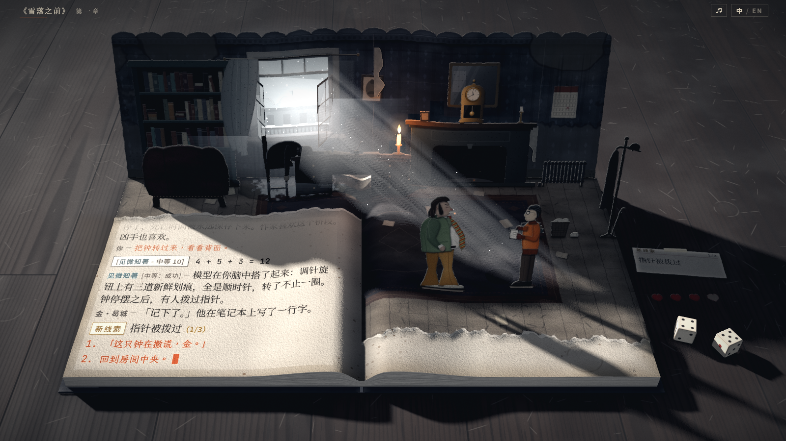
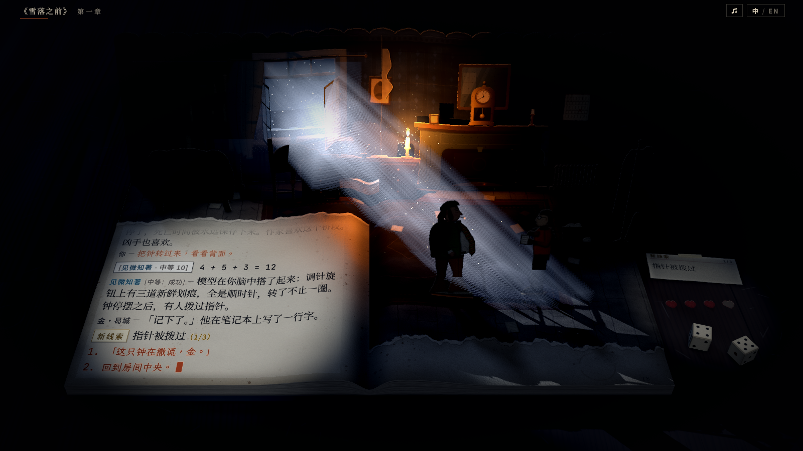

# 原作氛围预设：冬日与夜（`?look=`）

第四轮之后的用户反馈：原作的美术风格体现不够，场景太温馨，需要更大胆的尝试；`?style=1|2|3`（`docs/style-refs.md`）过于保守。此前的画面是一本干净、温暖的绘本：暖色台灯光池、奶油色纸、干净的蓝色墙纸、紫色地毯、柔和的光。

本轮新增两个运行时预设 `?look=winter`（冬日）与 `?look=noir`（夜），按原作画面的共同特征改写灯光、调色与材质：冷而低饱和的底色上只留少量互补色的强调；污渍与破败；深暗部、硬光与强对比。纹理没有重新烘焙。

## 1. 查看方式

- 页面参数 `?look=winter`、`?look=noir`，可与 `?still`、`?view=`、`?cast=`、`?style=`、`?lang=en` 组合，例如 `?still&look=noir&style=13&lang=en`。
- 不带参数时画面与 `main` 逐像素一致：`?still`、`?still&style=2`、`?still&style=123&lang=en`、`?still&view=0&cast=2`、`?still&view=3&style=1` 逐像素比较无差异；回忆状态除钟摆的相位（随实时时钟）外无差异。
- 与 `?style=2` 同用时，灯光与调色以本预设为准，预设 2 的斑驳与泛光保留。

| 默认 | 冬日 `?look=winter` | 夜 `?look=noir` |
|---|---|---|
|  |  |  |

其他对照图：

| 图 | 内容 |
|---|---|
| [look-0-room.png](look-0-room.png)、[look-winter-room.png](look-winter-room.png)、[look-noir-room.png](look-noir-room.png) | 房间，2 倍渲染后裁切 |
| [look-0-text.png](look-0-text.png)、[look-winter-text.png](look-winter-text.png)、[look-noir-text.png](look-noir-text.png) | 左页日志，2 倍渲染后裁切 |
| [look-0-flashback.png](look-0-flashback.png)、[look-winter-flashback.png](look-winter-flashback.png)、[look-noir-flashback.png](look-noir-flashback.png) | 回忆（昨晚 22:40，马雷克在书桌前），1600 × 900 |

## 2. 参考图与取用

参考图是用户在对话中提供的五张原作图，图片未入库，也没有外链。

| # | 画面 | 特征 | 取用 |
|---|---|---|---|
| 1 | 马丁内斯广场雪景，高俯视 | 低角度阳光投下蓝灰色的长硬影；低饱和（灰白、灰蓝、橄榄绿、锈红、铁黑）；颗粒感的画面纹理，踩脏的雪；落雪呈亮点 | 冬日的主光（低、硬、长影）与调色（降饱和、只留锈红、抬高并偏冷的黑位）；窗外过曝的雪；窗下的融雪 |
| 2 | 夜景 | 近黑的环境，一处暖黄光池，暗地与空中散布金色光点，剪影 | 夜的蜡烛光池（陡峭衰减）与烛火周围的金色光点；哈里与金的剪影 |
| 3 | 教堂内景 | 冷蓝白光穿过破裂的彩窗照进暗色木质空间，强对比，光束 | 两个预设共有的窗光光束（体积光，窗框与窗扇切出光条）；夜的月光 |
| 4 | 旋转破烂咖啡馆的地面，俯视 | 磨旧、脏污的马赛克地砖，处处刮痕与污渍 | 脏旧：地板的积灰与刮痕、地毯的磨损与污渍、桌面的刮痕与水渍 |
| 5 | Rostov 的表现主义概念画 | 青、橙、紫的强补色，深蓝暗部 | 夜的调色：暗部青蓝、亮部与烛光暖金（互补），深蓝近黑的暗部与暗角；冬日在冷底色上留锈红 |

## 3. 冬日（`?look=winter`）

- **主光**：低角度的冬日阳光，从房间左后方（窗的一侧）射入，光线朝读者与右方前进（仰角 21°，水平方向从正前方偏右 52°，强度 9，`#fff1e0`）。立着的纸片正面大多背光，地板、书页与桌面受光；长影朝读者与右方延伸，横过房间与桌面。主光软阴影的光源角半径从 4° 收到 1.2°，最大半影从 0.4 收到 0.16（`moodShadows`），影子更硬。
- **窗光**：墙挡住阳光，只从窗洞进入房间。窗洞后是一道带灰尘的光束，按主光的阴影贴图逐步采样，窗框、敞开的窗扇、书桌与人物把它切成几道光条；地毯上的光斑与光束出自同一张阴影贴图。
- **台灯**：白天关闭。回忆（昨晚）时随夜色亮起，冷色、较暗，只为日志照明，不投影。
- **蜡烛**：强度 7（默认 16），光晕 0.9 倍，画面里只剩这一点暖色。
- **补光**：半球光灰蓝（`#8796ad` / `#2c2f36`，0.42），环境光 0.09，阴影区呈蓝灰。
- **窗外**：远景提亮到过曝（颜色 1.35 倍），窗口前加一张冷白的眩光精灵；窗口的点光源偏冷、更亮（3.6，默认 2.6）。
- **调色**：饱和度 0.5；蓝紫转向灰蓝（墙纸、地毯）；只保留强的锈红（选项、地毯边、金的夹克、纸心），同色相但饱和度低的胡桃木不计入；暗部分离色调偏蓝；对比度 1.2；黑位抬高并偏冷（0.035 / 0.045 / 0.06），日志栏内只保留三成；暗角偏冷灰。
- **回忆**：夜色调色照旧；光束与眩光随夜色消失，主光颜色随夜色变为较暗的冷光（剧本指令只改主光强度，不改颜色）。
- **脏旧**：强度 1，窗下有融雪（第 5 节）。

## 4. 夜（`?look=noir`）

- **夜**：主光改为微弱的冷月光（强度 0.55，`#8ea6d0`）；半球光 0.1，环境光 0.02。
- **月光**：台灯移到窗外 30 个单位处，作为聚光灯只照进窗洞（光锥刚好罩住窗洞，其余被墙挡住；仰角 21°，水平方向偏右 46°），不随距离衰减，投影。光斑落在哈里与金身后的地毯上。光束与窗格光斑的做法同冬日。
- **蜡烛**：强度 30，照射距离 5.5 处截止，形成陡峭衰减的暖光池；光晕 2.2 倍；烛火周围 90 个金色光点，熄烛时消失。月光光束中另有 180 个光点。
- **两束窄光**（不投影）：一束照日志（`log-beam`），一束照桌面上的线索卡、纸心与骰子（`table-beam`）。
- **人物**：哈里与金去掉自发光（默认是台灯在书页上的反光），在月光前成为剪影。马雷克的纸片本身近黑，回忆中加冷色自发光，否则在暗处看不见。
- **窗外**：远景压暗为夜蓝，屋顶积雪为月光下的灰蓝。
- **调色**：饱和度 0.78；只保留烛光的金色；暗部偏青蓝、亮部偏暖；对比度 1.22；黑位略压低；暗角更深更大、偏冷黑，日志栏内只保留两成；回忆的夜色深度 0.5（本来就是夜，只再冷一点）。
- **脏旧**：强度 0.85，没有融雪。

## 5. 脏旧（`src/scene/grime.ts`）

在材质的着色器里加几行（`onBeforeCompile`），按各纸片自己的书页像素坐标生成，不需要纹理；纸片折叠、立起时污渍跟着纸片走。桌面按世界坐标生成。

| 表面 | 内容 |
|---|---|
| 墙纸 | 踢脚线以上的返潮：深色墙纸上呈褪色的土黄，边缘一道褐色水线；书架与日历上方檐口漏水的水渍与流痕；窗台下的水痕；壁炉台上方的烟熏；两条接缝处墙纸剥落，露出灰浆，卷边有浅色纸背与阴影；右下一处撕破；踢脚线附近的霉点；整体发暗 |
| 地板 | 沿墙积灰、踩出的脏斑、椅脚与鞋跟的刮痕；窗下的融雪（仅冬日）与水渍圈 |
| 地毯 | 走动处磨白、褪色；两块旧污渍；边缘磨损 |
| 立体层 | 书架、壁炉、书桌、扶手椅等纸片蒙一层灰，越靠近底部越暗，少量斑点 |
| 书页 | 纸色偏灰；页边与页尾泛黄；霉斑；右页一个杯底印。日志栏内纸色只暗四成、泛黄三成、霉斑两成半，保证墨迹对比 |
| 桌面 | 清漆变钝（粗糙度 +0.22），略降饱和，积灰；短刮痕；三个杯底水渍圈 |

## 6. 可读性

- 日志的排版、字号与纵向拉伸没有改动：1600 × 900 静帧中汉字高 15.3–17.3 像素，与默认相同。
- 对比度：日志区域纸面（亮度第 90 百分位）与墨迹（第 2 百分位）的相对亮度比 (L1 + 0.05) / (L2 + 0.05)，按上表的 1600 × 900 静帧测量。

| | 叙述 | 选项（锈红字） |
|---|---|---|
| 默认 | 10.1 | 4.2 |
| 冬日 | 9.7 | 3.7 |
| 夜 | 7.2 | 6.0 |
| 默认·回忆 | 9.3 | 5.1 |
| 冬日·回忆 | 5.5 | 4.1 |
| 夜·回忆 | 6.0 | 5.2 |

- 冬日的选项同默认一样是锈红字，纸面略灰，比值低 0.5；冬日回忆靠冷色台灯照明。夜的纸面整体较暗，墨迹也更黑，比值高于默认的选项。

## 7. 代价

- 帧耗时（M4 Pro，1600 × 900，4 倍 MSAA 加后期，`window.__bench`，三者交替测 9 轮取中位数）：默认 5.9 毫秒，冬日 6.9 毫秒，夜 7.8 毫秒。GPU 与其他进程共用时三者一起上升（一次测得 11.5 / 13.4 / 14.2 毫秒）。
- 冬日：台灯不投影，少一张阴影贴图；增加脏旧、光束（每像素 14 步，只在光束覆盖的像素上）与一盏不投影的台灯。夜：两盏不投影的聚光灯、光束与光点。
- 没有用泛光后期（`UnrealBloomPass`）：试过，每帧多 4–10 毫秒；窗口的眩光改用精灵。
- 构建产物的脚本从 724.0 kB 增加到 749.8 kB（gzip 205.6 → 214.5 kB），没有新纹理。

## 8. 实现

| 文件 | 内容 |
|---|---|
| `src/scene/mood.ts` | 解析 `?look=`（`parseMood`）；冬日主光的半影（`moodShadows`）；两个预设的灯光与调色、窗口眩光、光束与光点、脏旧；每帧跟随墙的立起与回忆的夜色（`update`） |
| `src/scene/shaft.ts` | 窗洞光束与光点：光线穿过窗洞形成的外壳，在片元着色器里沿视线逐步采样光源的阴影贴图；支持主光（平行光，普通深度贴图）与聚光灯（硬件比较的阴影贴图） |
| `src/scene/grime.ts` | 脏旧着色器 |
| `src/scene/lights.ts` | `createLights` 的 `soft` 参数（主光半影，编译进着色器，须在材质编译前给定）；`candle.power`（蜡烛的稳定强度，剧本指令在它上面乘倍数）；返回 `halo` |
| `src/scene/post.ts` | 调色参数 `uAccent`（保留一个色相）、`uLift`（黑位）、`uNightDepth`（回忆夜色深度）、`uQuietLook`（日志栏内保留多少黑位与暗角），默认值不改变画面；后期通道链未改动 |
| `src/main.ts` | 解析参数；在 `applyPainting`（`?style=2`）之后、`createCues` 之前应用，所以回忆、重击时暗一拍与结尾变暗都从预设的数值出发；帧循环里调用 `update`；`?debug` 暴露 `mood` |

- 剧本指令不碰台灯，也不改主光颜色，这两项由预设在 `update` 里按回忆的夜色（`uNight`）驱动。
- 光束与光点随墙立起淡入：开场时立体层折在书页上，光束不显示。
- 调整入口：灯光与调色数值集中在 `mood.ts` 的 `applyMood`；光束的步数在 `shaft.ts` 的 `STEPS`，密度与衰减是 `createShaft` 的参数；污渍的位置与强度在 `grime.ts` 各段着色器里。
- 单元测试：`src/scene/mood.test.ts`（参数解析与半影，3 项），总数 44。

## 9. 验证

- `npm test`（44 项）、`npm run build`、`npm run shot`（默认静帧与此前逐字节相同）、`node tools/play.mjs --no-build`（中英文通关，无控制台警告或错误）。
- 两个预设各中英文通关一遍（`tools/play.mjs` 的临时副本，页面地址追加 `&look=`，未提交），无控制台警告或错误，三个旗标与结尾正常。
- 与其他参数组合（`?style=2&view=0`、`?style=13&lang=en&cast=2`、`?view=3`、`?style=3&lang=en`）无报错。

## 10. 已知问题

- 光束只按光源的阴影贴图判断受光，不知道相机方向上的遮挡：不透明纸片（如书桌）背后的光雾也叠加在纸片上，书桌上方有一层淡淡的雾。
- 光束每像素 14 步，按像素抖动起点，静帧放大后可见细密的颗粒。
- 冬日：扶手椅背的影子斜落在日志左上角，影中的文字仍可读（第 6 节）。
- 冬日：回忆时阳光方向不变，只变暗变冷，夜里仍有长影。
- 冬日：窗下的融雪大半被书桌挡住，只在书桌前露出几块。
- 夜：金站在月光光斑的边缘，剪影不如哈里清楚。
- 夜：`?style=3` 的检定纸条有一部分落在桌面那束光之外，偏暗。
- 眩光是精灵，不会漫到周围的纸片上；与 `?style=2` 同用时预设 2 的泛光仍在（多几毫秒）。
- 纹理未重新烘焙：墙纸、地板原有的图案与颜色仍在，脏旧叠加在上面。
- 参考图 2 里暗地上散布的金色光点只做了空中的部分，地面上没有。
