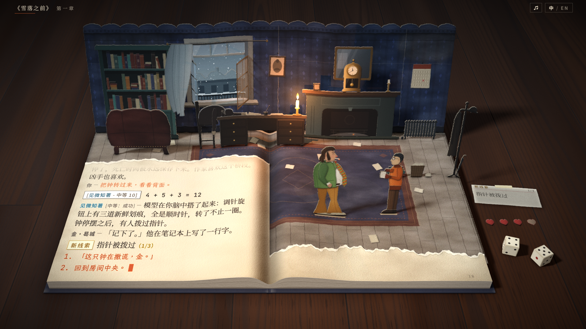
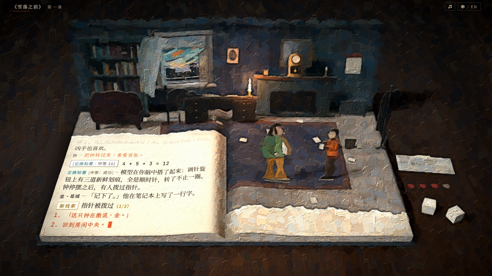
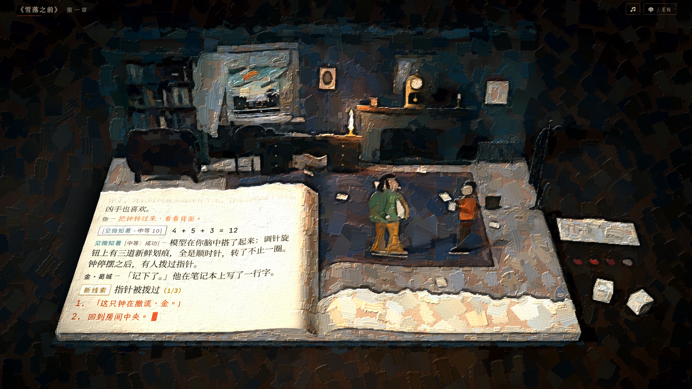

# 油画渲染（`?paint`）

整帧重绘成油画的渲染模式：书房仍是纸艺立体书，画面按油画的笔触、刮刀、颜料厚度与画布纹理重新画出，窗外换成按 Aleksander Rostov 概念画绘制的城市。针对用户反馈「对于原作的美术风格的体现还不够，场景也太温馨了。还需要更大胆的风格尝试」；此前的 `?style=1|2|3`（`docs/style-refs.md`）被认为过于保守。

## 1. 查看方式

- `?paint=1`（`?paint` 同）：油画。以笔刷为主，少量刮刀，冷色调色板。
- `?paint=2`：更大胆。笔触更大，约三成粗笔是刮刀痕，底色更冷更灰，暖色底与污渍更多。
- 不带参数时画面与改动前逐像素一致：`?still` 静帧的截图字节相同，`npm run shot` 重新生成的 `style-board-three*.png` 与已提交的相同。
- 可与其他页面参数组合。已看过的组合：`?lang=en`、`?view=3`、`?cast=2`、`?style=123`（`?style=2` 的辉光在油画之前生效），以及视差两端、还原的夜色、结尾熄烛。其他分支的 `?look`（光影、氛围、污渍）与 `?ui`（对话界面）在设计上互不依赖：油画在胶片调色之后运行，文字栏由胶片通道的 `uQuiet` 决定。

| 默认 | `?paint=1` | `?paint=2` |
|---|---|---|
|  |  |  |

| 图 | 内容 |
|---|---|
| [paint-1-room.png](paint-1-room.png) | `?paint=1`，房间 2 倍渲染裁切（窗、壁炉、蜡烛、纸偶）：笔刷、鬃毛条纹、颜料起伏、画布纹理 |
| [paint-2-room.png](paint-2-room.png) | `?paint=2`，同一裁切：刮刀痕、暖色底、污渍 |
| [paint-1-text.png](paint-1-text.png) | `?paint=1`，左页 2 倍渲染裁切：日志文字保持清晰，页面其余部分是油画 |
| [paint-1-view3-cast2.png](paint-1-view3-cast2.png) | `?paint=1&view=3&cast=2`：与取景 3、纸偶 v2 组合 |

## 2. 做法

`src/scene/paint.ts` 的 `PaintPass` 接在合成器末尾，接管胶片通道（`post.ts` 的 FilmShader）：胶片通道在合成器中停用，由油画通道用同一个材质把场景调色到一张设备分辨率的 8 位目标，再从这张图开始画。曝光、还原的夜色等舞台提示仍作用于胶片通道的 uniform。胶片颗粒关闭（Kuwahara 会把颗粒抹成斑块），由画布纹理代替。

1. **降采样与调色板**：四次双线性取样把调色后的图缩到画素分辨率（每 2 帧像素一个画素，800 × 450），并换到画家的调色板：蓝色往青色转并降饱和（Rostov 的天空与阴影）；中等饱和度向灰收，高饱和的强调色（纸偶的绿外套、橙夹克、烛光）保留；暗部以柔光往冷青、亮部往赭石；对比度 1.12 / 1.2。
2. **结构张量**：RGB 的 Sobel 梯度外积，高斯平滑（σ = 2 / 2.5 画素），得到每处的流向（变化最小的方向）与各向异性。
3. **各向异性 Kuwahara**：Kyprianidis 等 2009 年的各向异性 Kuwahara 滤波，8 个扇区，扇区权重用 2010 年的多项式形式。椭圆沿流向拉长，拉长程度随各向异性。采样点是单位圆里固定的半环（`?paint=1` 三环 15 对，`?paint=2` 四环 24 对，每点与其对称点成对），扇区权重因此是常数，在生成着色器时算好并展开，零权重省去；双线性取样代替点间的像素。结果是沿形体走向的平涂色块，边缘保留（刮刀般的压平）。
4. **笔触**：两层抖动网格，粗层每 26 / 36 帧像素一格，细层每 10 / 13 帧像素一格，每格一笔。
   - 笔的中心在格内随机，方向取中心处的流向；平坦处流向不可靠，改用缓慢漂移的默认方向（约 −30° 加噪声）。逐像素再把笔轴往该处的流向弯 60%，笔随形体弯曲。
   - 每笔带两种颜料，从 Kuwahara 结果沿笔轴分别向起点与终点取色，再按笔改变明度、冷暖（往橙或往青绿）与饱和度。细层只在图像有细节处落笔（张量强度决定落笔概率）。
   - 笔刷形状：起笔圆钝，收笔干擦、断成鬃毛的细丝；两侧毛边；鬃毛条纹里两种颜料交替；约四分之一的笔为厚涂，其余是薄涂。收笔处颜料变薄，露出底色。
   - 刮刀：`?paint=1` 12%、`?paint=2` 30% 的粗笔改为刮刀痕：斜切、一端收窄、落刀的边整齐、起刀的边破碎，刮痕处颜料薄，两种颜料横向混合，起刀一侧有一道颜料脊。
   - 遇到强颜色边界时，笔的颜色让位于底下的颜色（按颜色差的高斯），物体轮廓因此不被大笔抹掉。
   - 合成：逐像素取随机深度最高的一笔，以及其下完全覆盖该像素的最高一笔，前者柔边叠在后者上；没有笔的地方是底层（Kuwahara 结果）。
   - 暖色底：底层混入熟褐色的底色（按明度调整深浅），在笔间空隙、干擦处与刮痕里露出，与冷色笔触形成补色。
   - 污渍：约 85 帧像素尺度的暗斑降低部分笔的明度，少数笔混入污浊的橄榄褐。
   - 边缘加深：比周围暗的地方再压暗，形成画出来的暗部轮廓。
   - 亮点：Kuwahara 抹暗的小亮点（烛焰、窗外的灯、高光）以原色点回。
5. **起伏与画布**：笔触通道把颜料厚度写在 alpha；最后一步按设备像素运行，用厚度的差分得到法线，左上方来光（线性化的 Lambert，平面亮度不变，加少量高光），最亮处减弱起伏。平纹画布（128 帧像素见方的可平铺纹理，48 根经纬线交错，线有粗细与游移）在颜料薄处更明显。
6. **保持清晰的区域**：日志文字栏与新线索卡片（落在书页上、飞向桌面的途中）显示胶片调色后的原画面，经过同一调色板，向外羽化约 20 帧像素，边缘随噪声起伏；区内保留三成起伏与画布纹理，书页仍属于画面。相机视差移动时重新投影文字栏，卡片每帧按其包围盒投影。

尺寸按帧像素（1600 × 900 的构图）换算，任何窗口大小画的是同一幅画。第 1–5 步中只有最后一步按设备像素运行，其余在 CSS 分辨率或更低运行，2 倍屏只多出最后一步与胶片调色的开销。

## 3. 参数

位置：`src/scene/paint.ts` 的 `LOOKS`。

| 项 | `?paint=1` | `?paint=2` |
|---|---|---|
| 画素 | 2 帧像素 | 2 帧像素 |
| Kuwahara 半径 / 锐度 q / 偏心 | 4 画素 / 8 / 1 | 6 画素 / 8 / 0.7 |
| 张量平滑 σ | 2 画素 | 2.5 画素 |
| 粗笔：格 / 半长 / 半宽 | 26 帧像素 / 1 格 / 0.5 格 | 36 / 1 / 0.52 |
| 细笔：格 / 半长 / 半宽 | 10 / 1 / 0.45 | 13 / 1 / 0.46 |
| 每笔抖动：明度 / 冷暖 / 饱和 | 0.09 / 0.09 / 0.14 | 0.11 / 0.12 / 0.18 |
| 颜色边界让位（颜色差的高斯宽度） | 0.3 | 0.38 |
| 刮刀比例 | 12% | 30% |
| 污渍：暗斑幅度 / 脏笔比例 | 0.14 / 8% | 0.2 / 14% |
| 蓝转青 / 蓝色降饱和 | 0.07 圈 / 25% | 0.1 圈 / 35% |
| 底色饱和度 / 强调色保留 / 对比度 | 0.72 / 0.9 / 1.12 | 0.6 / 1 / 1.2 |
| 冷暗部 / 暖亮部（柔光强度） | 0.5 / 0.3 | 0.85 / 0.55 |
| 暖色底比例 | 15% | 30% |
| 边缘加深 | 0.4 | 0.55 |
| 起伏 / 光泽 / 画布 / 文字区保留的起伏 | 0.7 / 0.35 / 0.35 / 0.3 | 1 / 0.45 / 0.45 / 0.3 |

笔在像素周围 3 × 3 格里查找，笔的半长不能超过 1 格（`src/scene/paint.test.ts` 检查）。

## 4. 窗外远景

`src/scene/paint-view.ts` 在启动时用 Canvas 2D 画出窗外远景，替换 `far.webp` 与 `far-snow.webp`（776 × 728，视框相同），弹出层、悬停提示与舞台提示照旧使用这两张纹理。

- 天空：冬天的早晨。深蓝、紫、青、奶油色与橙色的刮刀色块，沿左下到右上的风向排列，低处有太阳与光晕；青色区夹橙色块、橙色区夹紫色块。
- 城市：两排方块建筑（远排偏蓝紫、近排更暗），平顶、山墙与烟囱，暖黄与橙色的小窗（在画面里是 2–3 像素的亮点），港口起重机的剪影；暗青色的水面，太阳与窗灯的橙色倒影。
- 近处：窗外防火梯的铁栏杆与格栅。
- 雪（屋顶、起重机臂、栏杆上的积雪）画在第二张画布上。还原时按原来的方式消失，结尾前重新积起（剧本里「雪开始下，把防火梯盖得干干净净」）。
- 窗洞只露出画布纵向约 60–470 的部分；原来对面楼房的位置由水面与栏杆代替。

## 5. 参考图

用户附了五张原作参考图（未入库）；另有 `docs/style-refs.md` 乙组的外链，如 Rostov 的 [The Conquest of Revachol](https://cdna.artstation.com/p/assets/images/images/026/369/814/4k/aleksander-rostov-conquest-of-revachol-flat-contrast.jpg?1588604494) 与 [人物原型画](https://cdnb.artstation.com/p/assets/images/images/026/371/871/4k/aleksander-rostov-arc-physical.jpg?1588607552)。

| 参考 | 特征 | 用在 |
|---|---|---|
| 雪中的马丁内斯广场，高俯视 | 灰白、灰蓝、橄榄、铁锈、铁黑的低饱和底色；处处是粗粝的笔触；飘雪是亮点 | 调色板的灰化与冷暗部；污渍与脏笔；小亮点点回 |
| 夜景，一处暖光 | 近黑的环境，唯一的暖光池与散落的金色亮点 | 暗部压冷；烛焰、窗灯以原色点回；还原的夜色在油画下成立 |
| 教堂，彩色玻璃 | 冷白光、深色木质前景、强明暗；右侧黑底衬线字的对话面板 | 对比度与边缘加深；文字区保持清晰（界面本身由 `?ui` 分支处理） |
| 旋转破烂的餐厅，俯视 | 磨损的马赛克地面，脏的可见笔触 | 两层笔触、两种颜料的条纹、污渍 |
| Rostov 的港口城市概念画 | 刮刀色块的天空（橙、青、奶油、紫、深蓝），方块建筑与小暖灯，暗水，蓝紫色雪，青橙补色 | 窗外远景整体；刮刀痕；暖色底与冷笔触的补色 |

共同点（画出来而非描出来；冷而灰的底色上有强补色；污渍与衰败；深暗部与强对比）分别对应：笔触与刮刀、调色板、污渍与暖色底、对比度与边缘加深。

## 6. 开销

测量：开发服务器，`?still`，同一页面里有油画与无油画交替（各 `window.__bench(6)`，每帧读回一个像素同步，与 `npm run shot` 打印的方法相同），40 轮取中位数；Apple M4 Pro，Chrome，ANGLE Metal。

| 1600 × 900 | 默认 | `?paint=1` | `?paint=2` |
|---|---|---|---|
| 1 倍 | 约 4.5 ms | 约 6.4 ms（+1.8） | 约 6.8 ms（+2.1） |
| 2 倍（3200 × 1800 绘制缓冲） | 约 10.3 ms | 约 12.6 ms（+2.3） | 约 13.0 ms（+2.7） |

- GPU 被其他进程占用时所有数字同比上升，油画部分也随之放大（一次测量中 1 倍默认帧 12 ms、`?paint=1` 22.6 ms）。
- 只在启动时做一次：窗外远景（Canvas 2D，约 2 ms）与画布纹理。

## 7. 已知问题

- 场景里的小字被画掉：桌面线索卡堆上的证据名、右页页码、`?style=3` 的检定纸条。新线索卡片在书页上与飞行途中保持清晰；卡片归入桌面卡堆后与其他卡一样被画。完整列表仍在悬停提示里。
- 小物件被概括：哈里的脸、钟面刻度、书脊的颜色条。`?paint=2` 更明显。
- 笔触固定在屏幕网格上，相机视差时画面在笔触下滑动，笔的颜色随之变化。小幅视差时帧间变化只比不画时略多（变化超过 24/255 的像素 1.2% 对 1.0%），烛光闪烁几乎不影响。
- 清晰区与画面的交界：清晰区外羽化约 20 帧像素，能看出笔触过渡到平滑的纸面；栏顶淡出的旧行在清晰区内。
- 还原的夜里整体偏灰，烛光的暖色被压低（胶片调色的夜色与调色板的冷暗部叠加）。窗外远景是自发光的，夜里仍是早晨的天空，只受夜色调色影响（原来的灰色天空也如此）。
- 与 `?look` 同时使用时两边的调色叠加，可能过暗、过冷，合并后需要一起调整。
- 2 倍屏上笔触层在 CSS 分辨率计算后放大，笔的边缘比 1 倍屏略软；起伏、画布与清晰区按设备像素计算。
- 需要可渲染的半浮点纹理（WebGL 2 的 `EXT_color_buffer_half_float` / `EXT_color_buffer_float`），与现有合成器的要求相同。
- `tools/play.mjs` 没有油画参数；`?paint=1` 的完整通关（中、英）用临时脚本验证过，无控制台错误。

## 8. 代码位置

| 内容 | 位置 |
|---|---|
| 参数解析、各强度参数、油画通道、画布纹理 | `src/scene/paint.ts`（`parsePaint`、`LOOKS`、`PaintPass`、`addPaint`、`kuwaharaTaps`） |
| 窗外远景 | `src/scene/paint-view.ts`（`paintWindowView`） |
| 挂接 | `src/main.ts`（读取参数；加载纹理后替换远景；`addPaint`；文字栏遮罩随相机、新线索卡片随动画更新）；`src/scene/post.ts`（返回胶片通道 `film`）；`src/scene/lead.ts`（`showing`：书页上的卡片） |
| 测试 | `src/scene/paint.test.ts`（参数解析、笔长限制、Kuwahara 扇区权重） |
