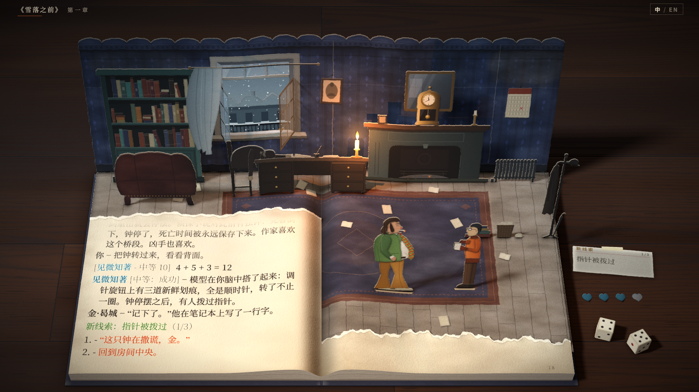
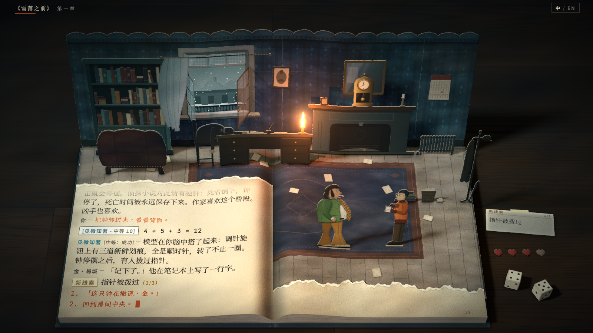
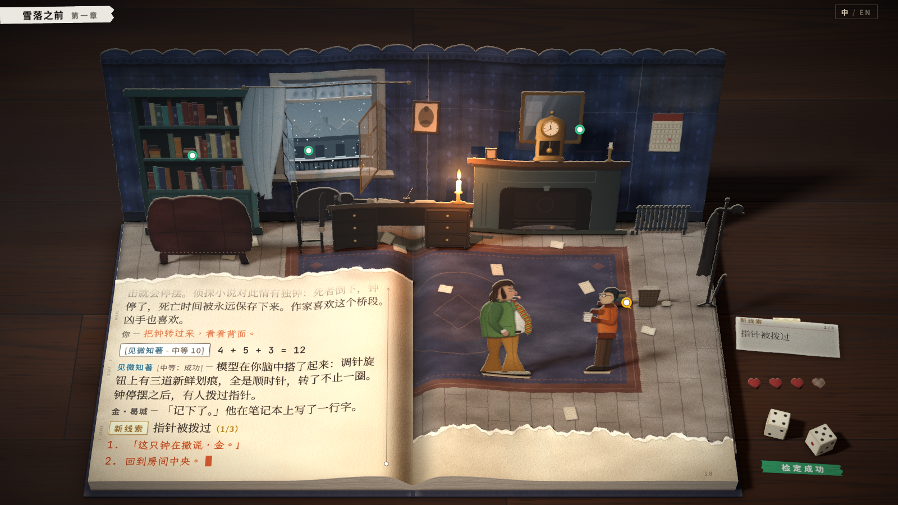

# 原作风格参考

为吸纳《极乐迪斯科》的美术风格与设计细节，整理三组参考图，并按每组做一个可切换的风格预设。三组分别对应：对话与界面（甲组，预设 1）、油画与光色（乙组，预设 2）、标志性细节（丙组，预设 3）。第 5 节是按优先级排列的细节清单，第 6 节是预设的说明与建议。

参考图均为外链，仓库不保存副本，版权归原作者（ZA/UM、Aleksander Rostov 等）。来源：Steam 商店页截图、Aleksander Rostov 的 ArtStation、Game UI Database、媒体与攻略站的截图（Adventure Corner、RPGFan、GAMEPRESSURE、gameplay.tips、Gabriel Chauri 的系统分析文章、九游）、官方网站与官方商店。Fandom 与 PCGamingWiki 有人机验证，未使用。

## 1. 查看方式

- 页面参数 `?style=1`、`?style=2`、`?style=3`，数字可组合（`?style=13`、`?style=123`）。不带参数是当前画面，与改动前逐像素一致。
- 可与 `?still`（风格板静帧）、`?lang=en` 同用，例如 `?still&style=1&lang=en`。
- 预设只改运行时：排版、画布绘制、CSS、灯光与后期。纹理没有重新烘焙。
- 日志字形高度不变：预设 1 的风格板静帧中汉字约 15.6–17.3 像素（1600 × 900），当前为 15.7–16.8 像素。

| 当前（无参数） | 预设 1 |
|---|---|
|  |  |
| **预设 2** | **预设 3** |
|  |  |

其他对照图：

| 图 | 内容 |
|---|---|
| [style-0-text.png](style-0-text.png)、[style-1-text.png](style-1-text.png)、[style-1-text-en.png](style-1-text-en.png)、[style-3-text.png](style-3-text.png) | 左页 1:1 裁切：当前、预设 1（中、英）、预设 3 |
| [style-1-tip.png](style-1-tip.png) | 预设 1：白色检定选项（白纸条）与检定卡片 |
| [style-1-red.png](style-1-red.png) | 预设 1：红色检定选项（橙红纸条，悬停）与检定卡片 |
| [style-1-continue.png](style-1-continue.png) | 预设 1：段落停顿时的继续条 |
| [style-1-hover.png](style-1-hover.png) | 预设 1：座钟的悬停提示 |
| [style-2-night.png](style-2-night.png) | 预设 2：还原时的夜色（可与 [m1-recon-2.png](m1-recon-2.png) 对照） |
| [style-3-table.png](style-3-table.png) | 预设 3：检定失败、士气受损后桌面上的两张纸条 |

## 2. 甲组：对话与界面（预设 1）

原作的对话面板是深底浅字，本 Demo 的日志印在奶油色纸上，是浅底深字。预设 1 的换算规则：原作最亮的白对应纸面最深的墨黑；原作的橙红、属性色、绿色压暗到在纸上可读（对比度 4.4 : 1 以上）；色条保留为贴在纸上的纸条。

### 甲-1 对话日志

出处：Steam 商店页截图。

- 说话者名称为粗体衬线，英文全大写。人物与恐怖领带（HORRIFIC NECKTIE）用同一种浅色；技能名按属性着色（内陆帝国、循循善诱为紫色）。
- 结果标签「[Easy: Success]」为灰色常规体，紧跟名称；之后是短破折号「–」，再接正文。
- 第二行起悬挂缩进约一个字宽，名称凸出在左侧。
- 选项以白色「1. -」开头，选项文字为橙红色。
- 较早的段落变暗（本 Demo 已有）。
- 中文版格式相同：名称粗体，短破折号，引号用 “ ”，第二行缩进约一字（[中文版截图](https://media.9game.cn/gamebase/ieu-gdc-pre-process/images/20231115/11/27/f155baf5d65746e80d1d46ac87766c27.jpg)）。

用在：左页日志。预设 1 改为粗体衬线名称、短破折号、悬挂缩进 1.05 字、「1. -」编号；选项与「你 —」行改用正文字体；恐怖领带用中性色；中文的「」换成 “ ”。

### 甲-2 白色检定

出处：Adventure Corner 评测图库。

- 白色检定的选项整行垫一条浅色横条（约 `#D0CCC0`），字为深色。不悬停时也有这条横条。
- 失败后被锁定的白色检定仍在横条上，字变灰，前面写「[Locked]」；已经选过的选项变暗（[另一张截图](https://www.adventurecorner.de/uploads/images/DiscoElysiumScreenshots/20191203172818_1.jpg)）。
- 画面本身：吊扇上挂着恐怖领带，是与它的第一次相遇。左下角头像上方两颗小菱形是生命（橙）与士气（蓝）。

用在：预设 1 的白色检定垫一张比纸面更白的纸条，底边有一道细阴影；失败待重试的检定仍在纸条上，字变灰；选过的选项变暗。桌面上的纸心改为士气的蓝色。

### 甲-3 红色检定

出处：Steam 商店页截图（Whirling-in-Rags 的咖啡厅经理 Garte）。

- 红色检定整行垫橙红横条（约 `#D7441A`），字为深红；悬停时字变白（[悬停截图](https://www.gabrielchauri.com/wp-content/uploads/2021/12/Disco-Elysium-3-1024x576.jpg)）。
- 普通选项悬停时不加横条，只把橙红字变白（[截图](https://shared.akamai.steamstatic.com/store_item_assets/steam/apps/632470/ss_dec29c440fab2f7817d68c1380c019290eb1755e.1920x1080.jpg)）。
- 左侧的对话者肖像是油画，带细框，贴在面板外。

用在：预设 1 的红色检定垫橙红纸条，悬停时字变浅；普通选项悬停时字变为墨黑。原先的红色菱形与光标方块不再使用。对话者肖像需要新画（第 5 节）。

### 甲-4 检定卡片

出处：GAMEPRESSURE 攻略页截图。

- 悬停检定选项时出现的深色卡片：表头为属性色色带，写「技能: 等级」（VISUAL CALCULUS: 4）；下面是黄色的概率描述词（EVEN）与大号百分比；修正项列在百分比下方（「+1 Heard crater story from Rene.」，见 [截图](https://gameplay.tips/wp-content/uploads/2023/08/image-73.jpeg)）；分隔线下写「This is a White Check. You may retry it.」；底部两组骰子图标，两个一点为「ALWAYS LOSES」，两个六点为「ALWAYS WINS」。
- 锁定的检定在百分比的位置写大号「LOCKED」与解锁条件（[截图](https://gameplay.tips/wp-content/uploads/2023/08/image-81.jpeg)）。

用在：预设 1 的选项提示改为这张卡片：表头取属性参考色，写「见微知著：3」；黄字位置用难度档位（「中等 10」）代替概率描述词；修正项、白色 / 红色检定说明与两组骰子依次排列；置灰的检定显示等待的原因。

### 甲-5 系统行、继续按钮与滚动条

出处：Game UI Database。

- 「New task: …」一类的系统行是绿色，不加框，与对话同一字体。
- 继续按钮「CONTINUE ►」是横贯文字栏的色条：左端是大写窄体字与三角箭头，右端有涂抹的颜料纹理。不同截图里色条有紫、青、红等颜色，规律未查明。中文版写「继续 ►」。
- 文字栏右侧是一条细竖线的滚动条，白色圆点标出当前位置；面板边缘有一列胶片边一样的竖排编码。

用在：预设 1 的新线索改为绿色系统行「新线索：指针被拨过（1/3）」；「▼ 继续」改为文字栏下方的红色继续条，箭头随光标闪烁。预设 3 在左页页边印出滚动条与竖排编码。

### 甲-6 物件悬停提示

出处：Adventure Corner 评测图库。

- 指针移到物件上时，旁边出现一条黑色半透明横条，浅色衬线字写一句描述，横条两端是不规则的笔刷边。不写物件名。

用在：预设 1 的悬停提示改为黑色横条、浅色衬线字、笔刷边，只显示描述句；士气与线索卡的提示保留名称与计数（「士气 3 / 4 – ……」）。

## 3. 乙组：油画与光色（预设 2）

### 乙-1 Rostov《The Conquest of Revachol》

出处：Aleksander Rostov 的 ArtStation。

- 暖橙与金黄的天空压在青黑的街区上；刮刀式的大笔触，近处物体用少量色块概括。
- 冷暖分区：亮部偏暖，暗部偏青，中间调饱和度低。

用在：预设 2 的分离色调（暗部往青绿、亮部往暖黄）、饱和度收敛与蜡烛的辉光。

### 乙-2 Rostov 人物原型画

出处：Aleksander Rostov 的 ArtStation（Disco Elysium Archetypes）。

- 哈里：绿色西装外套、白衬衫、棕色长裤；背景是粉红、青绿、橄榄色的竖向刮刀笔触。
- 轮廓不描线，靠色块与明暗交界区分。

用在：预设 2 的画面斑驳（沿固定斜向拉长的色块，只作低幅度的明暗与冷暖起伏，文字栏内减弱）。纸偶按原作重绘时参考（第 5 节）。

### 乙-3 室内：剖开的房间

出处：Steam 商店页截图。

- 室内像剖面模型：房间以外直接落入黑色，光源只有窗与一盏灯。
- 暗部是带青色的黑，不是中性灰。

用在：预设 2 加深并扩大暗角，暗角颜色改为偏冷的黑；桌面随之变暗，书与房间更突出。

### 乙-4 白天：雾

出处：Steam 商店页截图。

- 白天的马丁内斯是灰白的雾：低反差、低饱和，远处溶进雾里；人物衣物保留少量纯色。

用在：本章的「现在」是早上（房东太太今早七点发现了尸体），窗光按这种灰白调：预设 2 的主光、窗光与环境光改为偏青的冷白。

### 乙-5 白天：雪

出处：Steam 商店页截图。

- 雪地是带蓝的灰白，暗部冷黑，暖色只剩零星的灯与衣物。

用在：预设 2 的窗光颜色；窗外远景与窗台积雪的颜色（烘焙类，第 5 节）。

### 乙-6 夜：街灯

出处：Steam 商店页截图。

- 夜里整体为青黑，钠灯的暖黄光斑落在路面上，亮处有辉光。
- 按时间段归纳：早上与白天灰白、低饱和（乙-4、乙-5）；街灯亮起后暖光出现在局部（[截图](https://www.rpgfan.com/wp-content/uploads/2020/12/Disco-Elysium-Screenshot-032.jpg)）；夜里青黑底色上只有人工光是暖的（本图）。

用在：预设 2 的还原夜色（「昨晚」）改为青黑，蜡烛是画面里唯一的暖光，并带辉光。

## 4. 丙组：标志性细节（预设 3）

### 丙-1 交互标记

出处：Adventure Corner 评测图库。

- 可查看的物件上浮着白色圆点、绿色圆环；可对话的人物旁是黄色圆环加对话尾巴的标记。

用在：预设 3 在等待选择时，给座钟、窗户、书架（绿色）与金（黄色）加上同样的标记，标记在物件旁边、不遮挡物件；悬停时标记放大。

### 丙-2 检定与士气横幅

出处：Steam 商店页截图。

- 掷骰后，两枚白色线框骰子与一条绿色笔刷横幅「CHECK SUCCESS」出现在画面中；失败为红色「CHECK FAILURE」。
- 士气受损时是蓝色横幅「DAMAGED MORALE」，下方小一号的色块写「-1」（[截图](https://www.rpgfan.com/wp-content/uploads/2020/12/Disco-Elysium-Screenshot-027.jpg)）。

用在：预设 3 把横幅做成桌面上的彩色纸条：骰子停下后，骰子旁落下绿色「检定成功」或红色「检定失败」；失去士气时，纸心旁落下蓝色「士气受损 −1」。下一次选择时纸条淡出。

### 丙-3 思维阁与状态条

出处：Steam 商店页截图。

- 左上角是白色标题牌「THOUGHT CABINET」：从屏幕左缘伸出、略微倾斜的白色长条，黑色粗体窄字大写。
- 四个属性数值（INT、PSY、FYS、MOT）交替印在白色方块与深色底上，其下生命为橙色短条、士气为蓝色短条。
- 思维阁的格子是菱形，想法卡片是油画小图。

用在：预设 3 把左上角的书名放到白色标题牌上。士气的蓝色用在预设 1 的纸心。简化版思维阁（M2）可沿用菱形格。

### 丙-4 界面底栏

出处：Steam 商店页截图。

- 左下角是哈里与金的油画头像，头像上方两颗菱形按钮表示生命与士气。
- 右下角是时钟：大号窄体数字（12:00）后接小字的第几天；旁边是背包、思维阁、日志等图标。
- 场景里人物的对白浮在头顶，与物件悬停提示一样是黑色笔刷横条（「"Nice one, Cuno!!"」）。

用在：预设 3 把还原时的时间标记改为这种时钟：大号数字后接小字「昨晚」。

### 丙-5 恐怖领带

出处：官方商店的领带周边。

- 绿色底上叠着红、黄、蓝、灰的不规则色块与深色花纹。

用在：哈里纸偶的领带花纹（需要重新烘焙纸偶，第 5 节）；也可作书签丝带的图案。

### 丙-6 主菜单

出处：Game UI Database。

- 左侧橙色竖条上是细体窄字的大写菜单（CONTINUE、NEW GAME……），选中项垫深色横条（[暂停菜单截图](https://www.gameuidatabase.com/uploads/Disco-Elysium05242021-082618-41570.jpg)）；背景是 Rostov 的城市油画；右下角为 DISCO ELYSIUM 标志。

用在：预设 3 的标题牌与时钟用同类窄体大写字（Barlow Condensed）。将来的封面或开场页可参考这种构图。

## 5. 设计细节清单（按优先级）

熟悉感按原作玩家一眼能认出的程度估计；代价按改动范围估计。「运行时」表示不需要新纹理。

| # | 细节 | 熟悉感 | 代价 | 现状 |
|---|---|---|---|---|
| 1 | 白色检定垫白纸条、红色检定垫橙红纸条，悬停时字变浅 / 变黑 | 高 | 低，运行时 | 预设 1 |
| 2 | 名称粗体衬线、短破折号、悬挂缩进、「1. -」编号、选项橙红、选过变暗 | 高 | 低，运行时 | 预设 1 |
| 3 | 检定卡片：属性色表头、大号百分比、「必定失败 / 必定成功」骰子 | 高 | 低，运行时 | 预设 1 |
| 4 | 继续条「继续 ►」 | 高 | 低，运行时 | 预设 1 |
| 5 | 检定结果与士气受损的彩色纸条 | 高 | 低，运行时 | 预设 3 |
| 6 | 交互标记：绿圈白点（物件）、黄色对话标记（人物） | 高 | 低，运行时；需按剧情节点决定标在哪些物件上 | 预设 3（只标开场选项对应的物件） |
| 7 | 对话者与技能的油画肖像 | 高 | 高，需新画：金、马雷克、恐怖领带与 9 项技能的肖像 | 未做 |
| 8 | 纸偶按原作形象重绘 | 高 | 高，重新烘焙 harry、kim | 纸偶分支进行中 |
| 9 | 悬停提示：黑色横条、笔刷边、只写描述句 | 中 | 低，运行时 | 预设 1 |
| 10 | 士气蓝色（生命橙色） | 中 | 低，运行时 | 预设 1（纸心） |
| 11 | 新线索改为绿色系统行 | 中 | 低，运行时 | 预设 1 |
| 12 | 中文引号 “ ” | 中（中文玩家） | 低，运行时 | 预设 1 |
| 13 | 油画调色：青色暗部、暖色亮部、暗角、辉光、斑驳 | 中 | 低，运行时；整体变暗，需与日志可读性一起调 | 预设 2 |
| 14 | 还原时的时间标记做成界面时钟 | 中 | 低，运行时 | 预设 3 |
| 15 | 书名放到白色标题牌上 | 低到中 | 低，运行时 | 预设 3 |
| 16 | 页边的滚动条与竖排编码 | 低 | 低，运行时 | 预设 3 |
| 17 | 恐怖领带做成书签丝带，从书脊垂到桌面 | 中 | 中，需新纸片 | 未做 |
| 18 | 背景板与地板改为刮刀笔触的纹理 | 中 | 高，重新烘焙 wall、floor、furniture、far | 未做 |
| 19 | 桌面道具：RCM 警徽、金的笔记本 | 中 | 中，需新纸片 | 未做 |
| 20 | 窗外远景按早上的灰白雾色重画 | 低到中 | 中，重新烘焙 far、far-snow | 未做 |
| 21 | 简化版思维阁用菱形格与油画小图 | 中 | 高，M2 功能 | M2 |

需要新烘焙的细节（只作描述，本次未做）：

- **对话者肖像（#7）**：日志左上方、左页撕口旁立一张小纸卡，纸卡上是说话者的油画头像，说话时换成对应的人或技能。画法按乙-2：刮刀笔触、色块概括、背景用属性色的竖向笔触。需要金、马雷克、恐怖领带与 9 项技能共 12 张，每张约 120 × 150 书页像素。原作里物件说话时也配一幅画（甲-2 的吊扇），书房里会说话的物件可以另加。
- **纸偶（#8）**：哈里按乙-2 与丙-5：绿色麂皮西装、白衬衫、金褐色喇叭裤，领带用丙-5 的花纹（绿底、红黄蓝色块）；金按原作：橙色飞行员夹克、深色短发、圆框眼镜、手里的笔记本。
- **书签丝带（#17）**：一条窄长的布纹纸片，从书脊顶端夹入，垂过书头落在桌面上，图案按丙-5；悬停时显示恐怖领带的一句台词。
- **笔触纹理（#18）**：墙纸与地板在现有配色上加刮刀式的斜向色块（乙-1、乙-2），块面大、边缘硬，不加细节纹理；纸纹与噪点保持克制。
- **桌面道具（#19）**：RCM 警徽为金橙色的圆形徽章纸片（官方网站纪念徽章的插画可作参考：[图](https://res.cloudinary.com/disco-elysium/image/upload/v1607512356/commemorative_pin_1_hxmit5.png)）；金的笔记本为深色封皮的小本，摊开在线索卡堆旁，线索卡堆可以改为夹在笔记本里。
- **窗外远景（#20）**：按乙-4、乙-5：灰白的雾与带蓝的积雪，远处建筑只留剪影。

## 6. 三个预设

### 预设 1：对话与界面（`?style=1`）

- 日志：说话者名称粗体衬线（英文全大写），恐怖领带用中性色；结果标签用正文字体、灰色；短破折号；第二行起悬挂缩进 1.05 字；选项以「1. -」开头，文字为压暗的橙红（`#B03A1B`），选过的变暗；选项与「你 —」行改用正文字体；掷骰行的检定标签不加框；中文引号换成 “ ”；新线索为绿色系统行；不再显示光标方块。
- 检定：白色检定垫白纸条，失败待重试时字变灰；红色检定垫橙红纸条（`#D24A21`），悬停时字变浅；普通选项悬停时字变墨黑。
- 继续：文字栏下方的红色继续条「继续 ►」/「CONTINUE ►」，文字栏相应缩短 20 书页像素。
- 选项提示：检定卡片（甲-4）。
- 悬停提示：黑色横条、笔刷边、只写描述句。
- 桌面：纸心改为士气的蓝色，失去的纸心为灰白。
- 位置：`src/page/layout.ts`（`ORIGINAL`、`INK_ORIGINAL`）、`src/page/painter.ts`（检定纸条、继续条）、`src/play/log.ts`（检定卡片）、`index.html`（卡片与悬停提示的样式）、`src/scene/hearts.ts`（纸心换色）。

### 预设 2：油画与光色（`?style=2`）

- 灯光：主光与窗光改为偏青的冷白，环境光偏青绿；台灯与蜡烛更橙。
- 调色（`src/scene/post.ts` 的新参数，默认值不改变画面）：蓝紫色相往青转并降低饱和；暗部往青绿、亮部往暖黄的分离色调；饱和度 0.92；对比度 1.14；幅度 ±5% 的斜向斑驳，文字栏内减为三成；暗角更大、更深、颜色偏冷，边缘随斑驳起伏；亮度超过阈值处加辉光（蜡烛）。
- 夜色：还原时的夜色改为青黑。
- 位置：`src/scene/palette.ts`（全部参数）、`src/scene/post.ts`。

### 预设 3：标志性细节（`?style=3`）

- 交互标记：等待选择时，座钟、窗户、书架旁是绿圈白点，金的头旁是黄色对话标记；悬停时放大。
- 桌面纸条：骰子停下后落下「检定成功 / 检定失败」，失去士气时落下「士气受损 −1」，下次选择时淡出。风格板静帧显示「检定成功」。
- 页边：左页右边距印滚动条与位置圆点，左边距印竖排编码。
- 界面：书名放到白色标题牌上；还原时的时间标记做成界面时钟（「22:40 昨晚」）。
- 位置：`src/scene/details.ts`（标记与纸条）、`src/page/painter.ts`（页边）、`src/main.ts`、`index.html`。

### 建议

- 以预设 1 为基础：熟悉感收益最大，改动集中在日志与提示，纸面与立体书的概念不变，文字尺寸不变。
- 叠加预设 3 的检定纸条与交互标记（第 5 节 #5、#6），页边编码与标题牌可不取。
- 预设 2 的整体更暗、更冷。建议只取青色暗部、暗角颜色与蜡烛辉光，斑驳减半后再比较。
- 组合查看：`?style=13`、`?style=123`。

### 待确认

- 普通选项悬停时字变墨黑，是否足够明显，或需要另加底色。
- 检定卡片黄字的位置：沿用难度档位，或改为原作的概率描述词（需要新增一组词条与字体子集）。
- 继续条的颜色：原作在紫、青、红之间变化，预设 1 固定为红色。
- 交互标记应标在哪些物件上：目前只标开场选项对应的物件，进入子节点后仍显示。
