# 原作界面：对话面板与 HUD（默认）

第五轮用户反馈：「对于原作的美术风格的体现还不够，场景也太温馨了。还需要更大胆的风格尝试」。本页记录对话日志与界面部分的尝试：`?ui=de` 把左页日志改为原作的深色对话面板，并在画面四周加上原作的 HUD。光影见 `docs/look.md`。

第六轮用户反馈：「`?look=winter&ui=de` 这个组合还不错，但有几个 UI 似乎没有实际用途」。这个组合改为默认；HUD 只留本章用得上的部分，见第 3.3 节。之后又有两条：「检定信息在书上弹出看起来不太真实」（去掉内心声音标签，3.3 节）；「文本可以小一点但是行间距、段间距、页边距明显一些」（3.4 节）。

参考图均为外链，仓库不保存副本，版权归原作者（ZA/UM）。

## 1. 查看方式

- 第六轮起为默认，不需要参数（`?ui=de` 仍然有效）。可与 `?still`、`?lang=en`、`?view=`、`?cast=`、`?style=`、`?look=` 同用。
- `?ui=book`：此前的书页排法（日志印在纸上、桌上的纸心、没有 HUD）。`?ui=book&look=warm` 是第五轮之前的默认画面，`?still&ui=book&look=warm` 的静帧与第六轮之前 `main` 的 `?still` 逐像素一致。
- 第四轮的 `?style=1`、`?style=3` 是按书页排法设计的：在深色面板下，日志按面板排；`?style=3` 不再印页边滚动条与编码（深色面板自带）。要看它们原来的样子，加 `ui=book&look=warm`。

## 2. 对比

第五轮的截图（暖色灯光下，HUD 尚未精简；左列是当时的默认，现在的 `?ui=book&look=warm`）：

| | 书页排法 | `?ui=de` |
|---|---|---|
| 风格板（`?still`） |  | 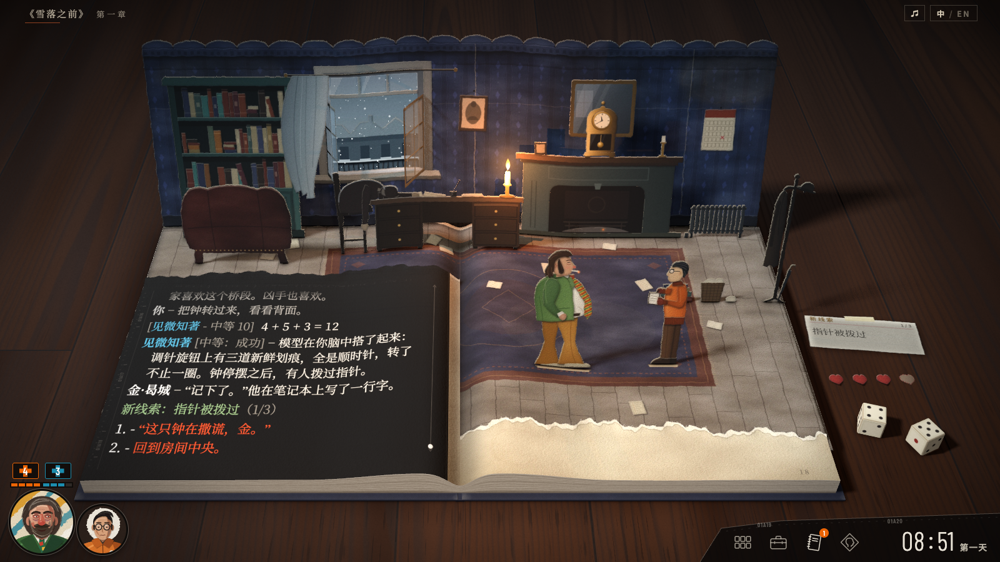 |
| 风格板，英文 | 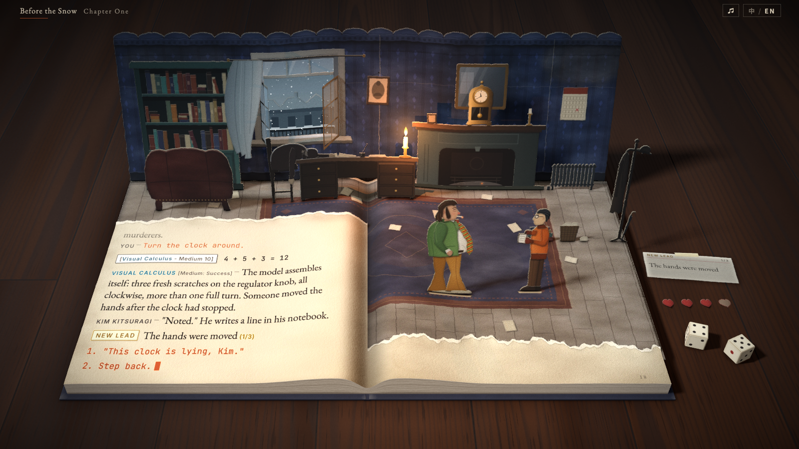 | 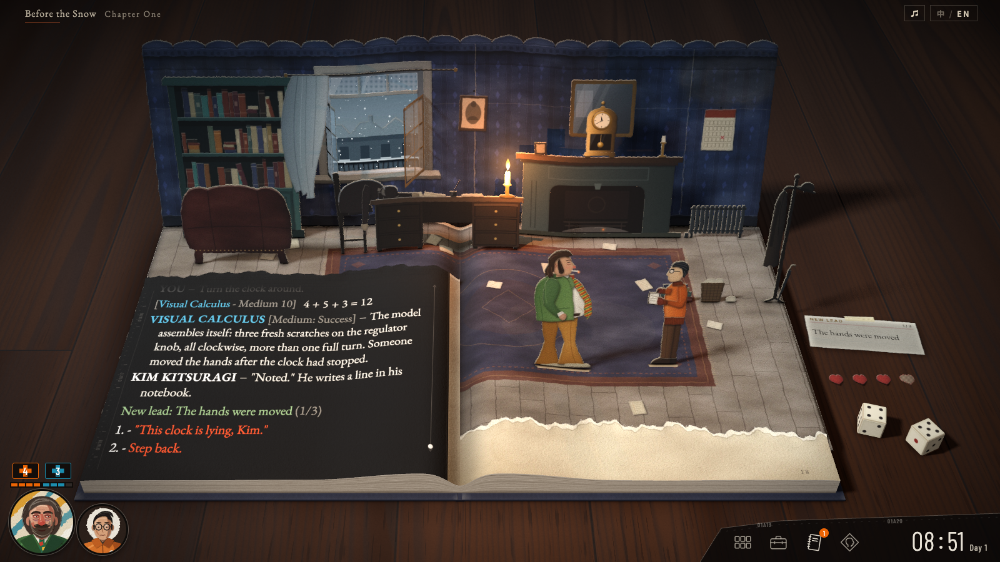 |
| 等待选择（金的五个选项，含一个红色检定） | 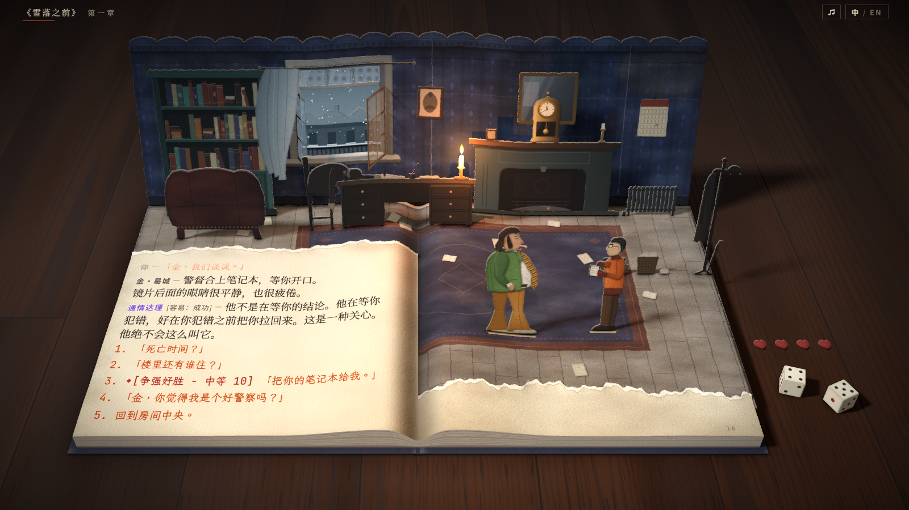 | 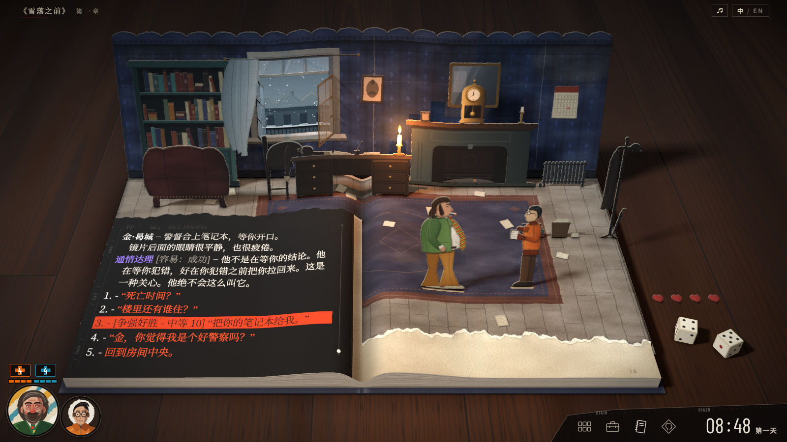 |
| 等待选择，英文 | 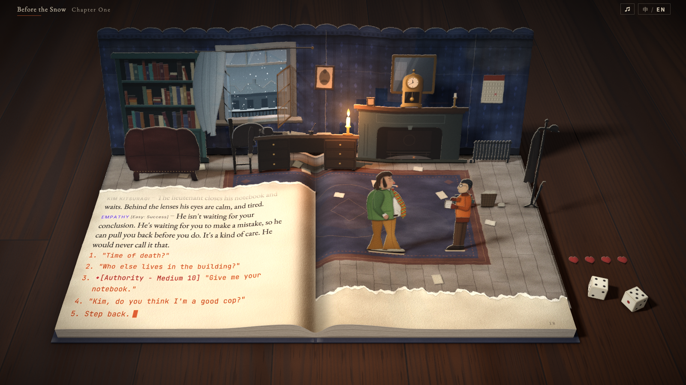 | 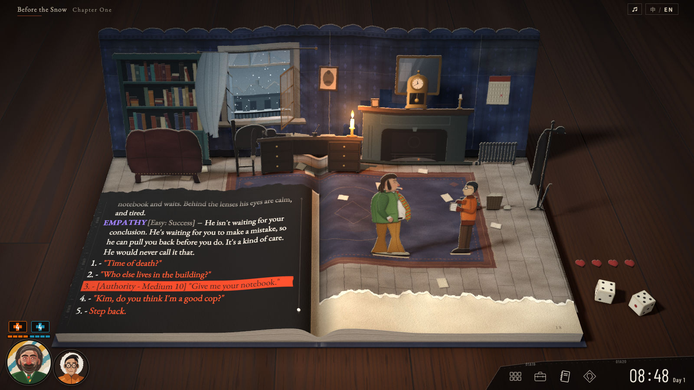 |

2 倍裁切与其他时刻：

| 图 | 内容 |
|---|---|
| [ui-de-panel.png](ui-de-panel.png) | 内心声音后的停顿：面板顶边的技能提示、属性色技能名、灰色结果标签、青色继续条与红色涂抹（2 倍） |
| [ui-de-panel-en.png](ui-de-panel-en.png) | 英文，等待选择：「1. -」编号、橙红选项、红色检定的橙红纸条（2 倍） |
| [ui-de-hud-left.png](ui-de-hud-left.png) | 左下：哈里与金的头像，生命与士气（2 倍） |
| [ui-de-hud-right.png](ui-de-hud-right.png) | 右下：工具图标、线索角标、时钟（2 倍） |
| [ui-de-hover.png](ui-de-hover.png) | 悬停白色检定：纸条变亮，检定卡片（2 倍） |
| [ui-de-check.png](ui-de-check.png) | 骰子停下后的「检定成功」横幅（2 倍） |
| [ui-de-night.png](ui-de-night.png) | 还原（夜色调色）：面板的可读性，HUD 时钟「22:40 昨晚」 |

## 3. 改动

### 3.1 左页：深色对话面板

- **面板**：印在左页顶层纸上的近黑色面板，不透明度 92%（撕口处）到 97.5%（书尾处），向书口与书尾出血，向上伸进撕口、被撕口切断，靠书脊一侧是直边和一条细线。页面受光后，面板在画面上约为 #242424–#2C2424（原作 #141414；纸面光照与哑光高光抬高了黑色）。面板按画布尺寸只画一次，绘在墨迹之下，旧行升入撕口时的淡出不影响面板。
- **胶片边**：面板外侧一列齿孔刻线与竖排帧编码（01A16–01A18）。
- **滚动条**：书脊一侧一条细线，两端箭头，白色圆点标出当前位置（在最新一行时位于底部），滚轮翻看历史时移动。
- **文字格式**（同 `?style=1` 的排法，换成原作自己的浅色）：说话者粗体衬线，英文全大写；短破折号；续行悬挂缩进约一字；选项以「1. -」开头；中文引号用 “ ”；新线索为绿色系统行「新线索：指针被拨过（1/3）」；掷骰行的检定标签不加框。
- **颜色**：正文浅灰 #E4DFD4，人物、物件、「你」与选项编号白色，结果标签灰色 #948F85，选项橙红 #F4592B（选过的变暗），技能名按属性着色：智力 #5CB9D6、精神 #9A7EF0、体格 #DE5C84、身手 #E0B43A。精神与体格比 `ATTRIBUTES` 的参考色提亮，见第 5 节。较早的段落变暗（与默认相同）。
- **检定**：白色检定整行垫浅色纸条（#D5D0C3），字为深色，悬停时纸条变亮；失败待重试的字变灰。红色检定垫橙红纸条（#D6431D），字为深红，悬停时变浅。
- **继续条**：文字栏下方横贯的青色横条（#5CC4D6），细体窄字「CONTINUE ►」/「继续 ►」，箭头随光标闪烁；右端的红色颜料（#8C2414）以斑块、纹路与断续的圈渗进青色。
- **悬停**：普通选项的字变白；检定选项显示原作的检定卡片（属性色表头、难度、成功率、白色 / 红色检定说明、必定失败 / 必定成功的两组骰子，与 `?style=1` 相同）。
- **尺寸**：字号与纵向拉伸不变。文字栏左缘右移 6 书页像素（给胶片边），下缘上移给继续条，窗口约 9.9 行（默认 10.5 行）。第六轮改为更小的字、更宽的行距、段距与边距，见 3.4 节。

### 3.2 HUD（第五轮）

第 3.3 节去掉了其中的生命、工具栏、胶片编码与日志图标的线索角标，士气只留在 HUD 上。

- **头像**（左下）：哈里与金的圆形头像，自绘，不是原作画作的复制。剪纸做法：分层纸片、撕边、每层一点投影；脸部用多个色块面（阴影里带绿与紫），头发与胡子用笔触叠出，整张叠一层画布纹理。哈里：绿色麂皮外套、恐怖领带、红眼圈与眼袋、酒糟鼻、灰白的头发与络腮胡，背景是黄、青、白的斜向笔触。金：橙色飞行员夹克与徽章、圆框眼镜、黑色短发，背景是原作金头像里的白色圆盘。
- **生命与士气**：哈里头像上方两个带十字的数字框（生命橙 #EC6404、士气蓝 #1C8DAE），下面一行分段格子。士气跟随剧情数值，失去一点时格子变暗，头像旁出现蓝色「士气受损 -1」横幅；生命不在本章规则里，保持满格 4。
- **说话者**：「你」或金的台词打出时，对应头像的外圈变亮（纸偶的上下晃动照旧）。
- **工具栏**（右下）：深色斜边托盘，带胶片编码；原作的四个工具图标（角色、物品、日志、思维阁），细线描绘；日志图标上的橙色角标是已找到的线索数，新线索时跳动，悬停列出线索（与桌上线索卡堆的提示相同）。其余三个图标只作装饰。
- **时钟**：细体窄字数字，后接小字「第一天」/「Day 1」。现在从 08:40 开始，每出现一行台词前进一分钟（原作的时间也只随对话推进）；风格板瞬间为 08:51，章末约 09:12。还原时显示时间标记的分钟（22:30 起，逐段到 23:30）与「昨晚」，数字转为冷蓝。顶部居中的时间标记在 `?ui=de` 下隐藏，仍留在页面里供读屏读取。
- **内心声音**：技能开口时，面板顶边左侧弹出黑色标签：技能名（属性色，窄体字，英文大写）与属性名；出现时整条先闪为属性色再褪为黑底。这一行是最新一行时一直显示，下一行开始或选项出现时淡出。恐怖领带不是技能，不弹标签。第六轮去掉，见 3.3 节。
- **横幅**：骰子停下时，骰子下方出现绿色「检定成功」或红色「检定失败」的笔刷横条，约 1.7 秒后淡出。与 `?style=3` 同用时，桌面纸条照常落下。
- **悬停提示**：物件悬停时为原作的黑色笔刷横条，只写描述句（与 `?style=1` 相同）；士气与线索保留名称与计数。
- **动画**：走虚拟时钟，`?speed`、减少动态效果与测试冻结都有效；不触发阴影贴图的刷新。

### 3.3 第六轮：只留用得上的部分

HUD 上每一项都要对应本章实际发生的事。去掉的元素与原因：

| 元素 | 原因 |
|---|---|
| 生命的数字框与格子 | 本章规则里没有生命，始终是满格 4 |
| 工具栏的角色、物品、思维阁图标 | 只作装饰，点击没有反应 |
| 日志图标与线索角标 | 与桌上的线索卡堆重复：卡堆已有计数与悬停列表，新线索卡也会落在右页 |
| 托盘上的胶片编码 01A19、01A20 | 装饰 |
| 桌上的四颗纸心（`?ui=de` 下） | 与 HUD 的士气重复；冬日光下纸心又小又暗，几乎看不见 |
| 内心声音标签（面板顶边的技能名与属性名） | 平面的 HTML 标签叠在倾斜的书页上，不随书页的透视、纸面与光照变化，看起来是贴上去的（用户：「检定信息在书上弹出看起来不太真实」）；技能名已按属性颜色印在日志行首，技能开口时还有按属性区分音高的铃声 |

保留的元素与用途：

- **头像**：谁在说话（外圈变亮）。
- **士气**（哈里头像上方的蓝色十字数字框与四格）：画面上唯一的士气显示。失去一点时，先出现「士气受损 -1」横幅，并响起下降的短句；变化的格子逐个闪亮后熄灭，十字框随之鼓起，每格约 0.7 秒，与纸心翻面的节奏相同，剧情的停顿不变。回升时反向，没有横幅。悬停十字框或格子显示士气提示「士气 3 / 4 – 失败会让它流失……」，提示放在金的头像右侧（那里是空的桌面，不会盖住日志与继续条）。
- **时钟**（右下）：现在的时间与回忆里的「昨晚」时间，代替顶部居中的时间标记。托盘缩小到只放时钟。
- **检定横幅**：不变。它在桌面上骰子下方，不在书上。

HUD 的原则：屏幕空间的元素只放在画面四角；要出现在书上或桌上的信息，印进书页或做成场景里的实物。

| 第五轮 | 第六轮 |
|---|---|
| 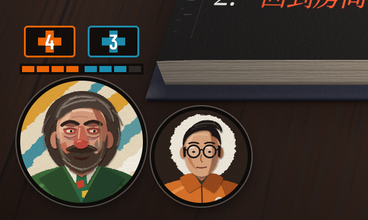 | 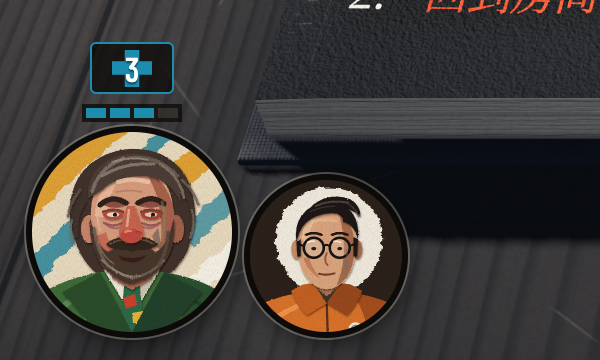 |
| 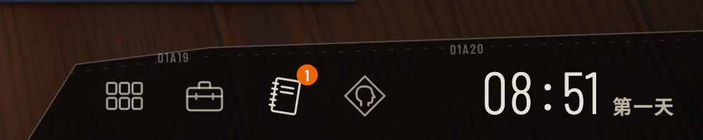 | 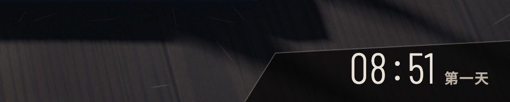 |

| 图 | 内容 |
|---|---|
| [ui-morale-loss.png](ui-morale-loss.png) | 窗户检定失败后：「士气受损 -1」横幅，第四格熄灭 |
| [ui-morale-tip.png](ui-morale-tip.png) | 悬停士气：提示在金的头像右侧 |

士气提示的原文「一颗也不剩的时候」（指纸心）改为「一点也不剩的时候」，英文「When no heart is left」改为「When none is left」，两种排法都适用。

### 3.4 第六轮：更小的字，更宽的行距、段距与边距

只改深色面板（默认）；书页排法（`?ui=book`）不变。

| 项 | 此前 | 现在 |
|---|---|---|
| 正文字号（书页像素） | 中文 24.5，英文 25 | 中文 22，英文 22.5（小约一成）；名称、标签、选项同比例缩小 |
| 行距 | 中文 34.4（1.40 倍字号），英文 32.8（1.31 倍） | 中文 36.5（1.66 倍），英文 35（1.56 倍） |
| 段距（两条日志之间） | 2 | 中文 15，英文 14（约 0.4 行）；选项之间 7 / 6 |
| 文字栏（书页像素） | 左 36、右 596、下缘距书尾 54 | 左 60、右 574、下缘距书尾 70；继续条随文字栏缩窄，底边距书尾 38 |
| 画面中的字形（1600 × 900 静帧，窗口顶到底） | 高 14.6–18.4 像素，宽 18.2 像素 | 高 13.2–16.2 像素，宽 16.3 像素；顶部行距 24 像素 |
| 窗口 | 约 9.9 行 | 约 9 行（有段距，实际约 7–8 行） |

锚定：日志自下而上排，最新一行贴着窗口底边；最后一条之后的段距不计入，继续条到最后一行的距离不变。

| 此前 | 现在 |
|---|---|
| 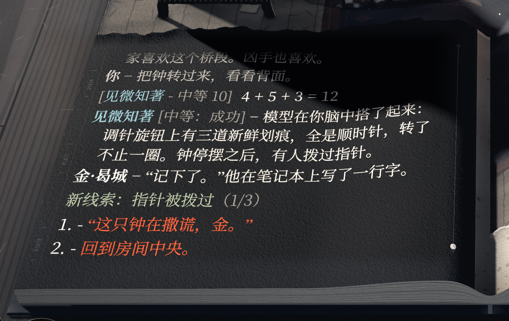 | 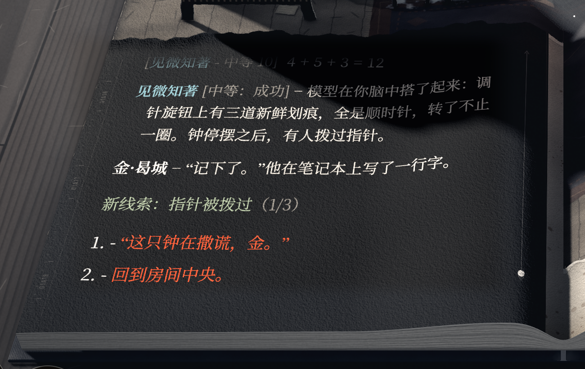 |
| | 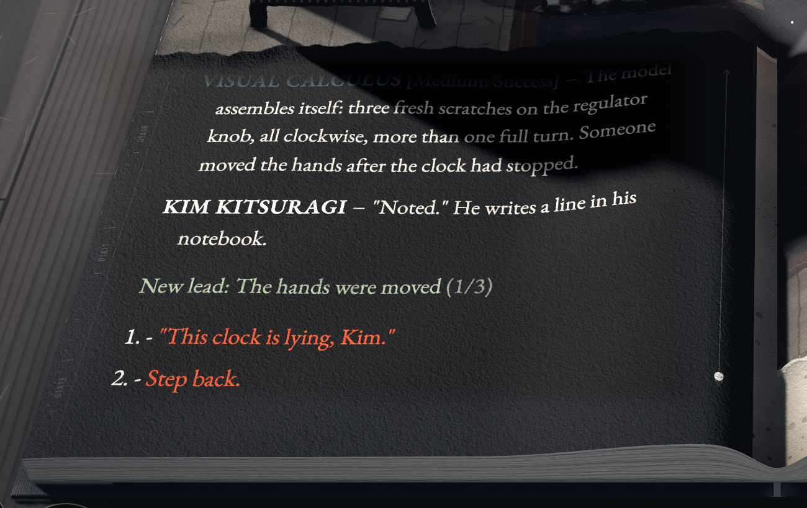 |

## 4. 出处

原作截图（外链）：

| 代号 | 图 | 用到的内容 |
|---|---|---|
| A | [Steam 截图：Idiot Doom Spiral](https://shared.akamai.steamstatic.com/store_item_assets/steam/apps/632470/ss_ab38615b3a1d0d4309f06772db4bd9db5c250ef7.1920x1080.jpg) | 面板的文字格式与颜色、胶片边、滚动条、右下工具栏与时钟 |
| B | [Game UI Database：面板与继续按钮](https://www.gameuidatabase.com/uploads/Disco-Elysium05242021-082736-92776.jpg) | 继续条（青色与红色涂抹）、绿色「New task」行、左下金的头像、时钟「08:13 Day 1」 |
| C | [Steam 截图：HUD](https://shared.akamai.steamstatic.com/store_item_assets/steam/apps/632470/ss_b3694e99ffdb686d1bbbbe16a540d3d2ccd509c4.1920x1080.jpg) | 两张头像、生命与士气的数字框和格子、工具图标、时钟「12:00 Day 1」 |
| D | [Steam 截图：Garte](https://shared.akamai.steamstatic.com/store_item_assets/steam/apps/632470/ss_23836438cd455287232be5ae9c4f48d5c488967b.1920x1080.jpg) | 红色检定的橙红横条、工具图标上的橙色角标 |
| E | [Adventure Corner：恐怖领带](https://www.adventurecorner.de/uploads/images/DiscoElysiumScreenshots/20191127170928_1.jpg) | 白色检定的浅色横条 |
| F | [Adventure Corner：物件描述](https://www.adventurecorner.de/uploads/images/DiscoElysiumScreenshots/20191130180527_1.jpg) | 黑色笔刷横条的悬停描述 |
| G | [Steam 截图：检定成功](https://shared.akamai.steamstatic.com/store_item_assets/steam/apps/632470/ss_dec29c440fab2f7817d68c1380c019290eb1755e.1920x1080.jpg) | 「CHECK SUCCESS」横幅；悬停的普通选项变白 |

用户附图：a 对话面板（右侧半透明黑色面板、胶片边、粗体大写名称、赭色检定名、青色继续条与红色涂抹、左下金的圆形头像、右下四个图标与橙色提示点）；b 游戏中的 HUD（两张油画头像、生命与士气、工具栏、时钟「09:10 Day1」）；c 夜景与底部居中的白色字幕。

| 元素 | 依据 | 取值（从截图取样） |
|---|---|---|
| 面板底色 | A、B、附图 a | #141414 |
| 正文、名称、结果标签的格式 | A、D、E | 名称大写与正文同号；结果标签灰色；短破折号 |
| 选项颜色、悬停变白 | A、G | 橙红 #FC5424 |
| 技能颜色 | A、B、G | 精神 #8C6CEC、智力 #5CC4D4；身手取 `ATTRIBUTES` 的参考色 |
| 白色 / 红色检定的横条 | E、D | 浅色横条、橙红横条，右端不规则 |
| 新线索绿色行 | B | #94B484 |
| 继续条 | B、附图 a | 青 #5CC4D6，红 #8C2414 |
| 胶片边、滚动条 | A、B、附图 a | 细线、白色圆点、竖排编码 |
| 头像与生命、士气 | C、附图 a、b | 生命 #EC6404，士气 #0C7C94；数字框加十字、分段格子 |
| 工具图标、角标、时钟 | A、C、D、附图 a、b | 四个线描图标；橙色角标；细体窄字时钟、小字天数 |
| 检定横幅 | G | 绿色笔刷横条、白色窄体大写字 |
| 悬停描述 | F | 黑色横条、浅色衬线字、不写名称 |
| 内心声音提示 | 原作在面板左侧挂当前说话者的肖像，技能说话时是技能的肖像（A 中精神类技能的紫色肖像） | 本 Demo 没有技能肖像，改为面板顶边的技能名标签（第六轮去掉） |

附图 c 的底部居中字幕没有采用：本 Demo 的台词都在日志里，另开字幕会与日志重复。

## 5. 可读性与输入

在 1600 × 900 画面上测量（`window.__shot.metrics` 与截图取样）：

| 项 | 默认 | `?ui=de` |
|---|---|---|
| 正文字号（书页像素）与纵向拉伸 | 24.5，1.21 | 相同 |
| 风格板正文字形高度（窗口顶到底） | 15.3–17.3 像素（中文，测 5 行） | 14.6–18.4 像素（中文，测 9 行）；英文 15.1–18.7 |
| 字形宽度 | 18.4 像素 | 18.2 像素 |
| 窗口行数 | 10.5 | 9.9（中文）、10.2（英文） |
| 正文对比度 | 10.8 : 1 | 14.7 : 1 |
| 选项对比度 | 4.1 : 1 | 5.2 : 1 |
| 技能名对比度 | — | 智力 8.3、精神 5.5、体格 5.3、身手 10.0 : 1 |
| 新线索行、结果标签 | — | 8.7、5.3 : 1 |
| 还原时（夜色） | — | 正文 12.3、智力 5.7 : 1 |
| 红色检定纸条上的深红字 | — | 3.9 : 1 |

- 字形高度的两列测的行数不同（深色面板里名称与选项也是衬线体，都计入），同一位置的字形尺寸没有变化。
- 对比度按截图计算：底色取区域亮度 30% 分位，字色取最亮的 1%；细笔画取不到纯色，数值偏保守。
- 精神与体格用 `ATTRIBUTES` 的参考色时只有 4.0 与 3.9 : 1，因此 `ATTRIBUTES` 新增 `panel` 色，把这两项提亮（原作面板上的精神色 #8C6CEC 本来就比参考色亮）。
- 输入：点击选项、数字键 1–9、空格与回车推进、点击补全正在打字的一行、滚轮翻看历史，都与默认相同；日志的读屏镜像（有序列表与选项按钮）不变。HUD 设为 `aria-hidden`，只有日志图标接收指针（悬停提示）。
- 通关：`?ui=de` 下按 `tools/play.mjs` 的路径与检查无头通关中英文各一遍，无控制台警告或错误。

## 6. 取舍

两个方向：

1. 日志留在书页上，左页变成原作的深色面板（本页实现的 `?ui=de`）。
2. 日志移出书页，放到画面右侧的 HTML 面板，书只作舞台（`?ui=panel`，未实现）。

选 1，2 没有做原型。原因：

- 按原作比例，右侧面板要占画面宽度约 30%，会盖住右页右侧、衣帽架，以及桌面上的线索卡堆、纸心与掷骰区域；要让开，书需要缩小约 15% 并左移，桌面道具仍会被部分遮住。
- 左页撕口以下的文字区会空出来，「文字印在书页上」这一立体书的前提不再成立。
- 1 保留书页的透视、光照、撕口与纸面质感，字号不变，深色面板在画面中已足够醒目；HUD 放在画面四周，与原作一样叠在场景之上。

## 7. 字体

- 新增 Barlow Condensed 300（`barlow-condensed-300.woff2`，只含拉丁字符，与 500 字重同一份字符表），用于 HUD 时钟与继续条的细体字。
- 新增的中文界面文字只有「第一天」，三个字已在字体子集里，没有新字符。
- 运行 `npm run fonts` 时，思源宋体两个字重与思源黑体会多出「乐音」两个字，来自音乐按钮的 aria-label「音乐 / Music」（第四轮加按钮后没有重新裁剪）。这两个字不会被绘制，本分支没有提交这三个文件的变化。

## 8. 代码位置

| 内容 | 位置 |
|---|---|
| 参数解析 | `src/ui.ts`（测试 `src/ui.test.ts`） |
| 深色面板的排法与颜色 | `src/page/layout.ts` 的 `DE`、`INK_DE`，字号、行距与段距 `SIZES_DE`，`textColumn` 的 `de` 分支（边距），继续条尺寸 |
| 面板、胶片边、滚动条、继续条的绘制 | `src/page/de.ts` |
| 面板绘在墨迹之下、纸条与悬停颜色 | `src/page/painter.ts` 的 `under()` 与 `draw()` |
| 技能在面板上的颜色 | `src/content/skills.ts` 的 `ATTRIBUTES[].panel` 与 `speakerInk(…, 'panel')` |
| HUD | `src/play/hud.ts`；头像 `src/play/portraits.ts`；样式在 `index.html` 的 `data-ui` 一节 |
| 士气显示在哪里 | `src/main.ts` 的 `morale`：`?ui=book` 为桌上的纸心（`src/scene/hearts.ts`），否则为 HUD；两者有相同的 `value`、`set`、`to` |
| HUD 悬停提示的位置 | `src/main.ts` 的 `hotAnchored`：HUD 给出提示的位置，不按指针与日志栏摆放 |
| 台词开始的钩子 | `src/play/director.ts` 的 `Stagehands.line` |
| 接入 | `src/main.ts`（`UI`、`LOOK`、`CAPTIONS`、`createHud` 与各处 `hud?.…`） |
| 细体字 | `tools/subset-fonts.mjs`、`src/assets.ts` 的 `FACES` |

## 9. 待确认与已知问题

- 取景 0（`?view=0`）下书尾贴近画面下沿，左下金的头像贴近左页的角。
- 红色检定纸条上的深红字约 3.9 : 1（原作同样是深字配橙红底）。
- 原作在面板左侧挂当前说话者的肖像（人物、技能、物件各一幅），这里只有 HUD 的两张头像；技能与物件的肖像需要新画（`docs/style-refs.md` 第 5 节 #7），要放也应印在书页上，不做成浮在书上的平面标签。
- `?look=noir` 下深色面板上的选项偏暗。
- `?ui=panel` 未实现，见第 6 节。
