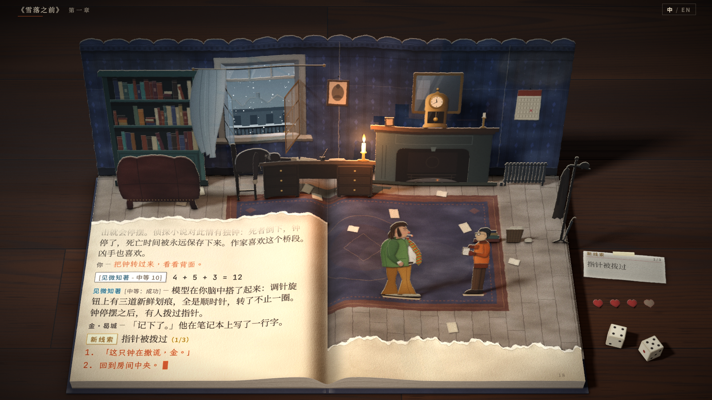
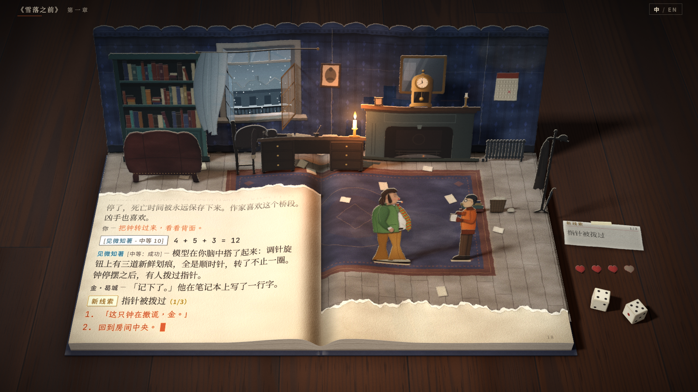
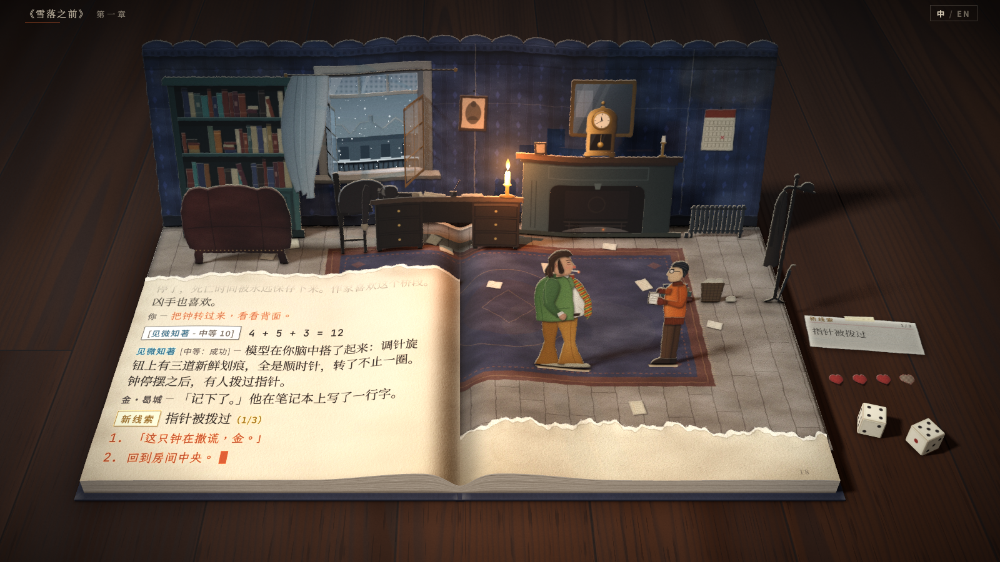
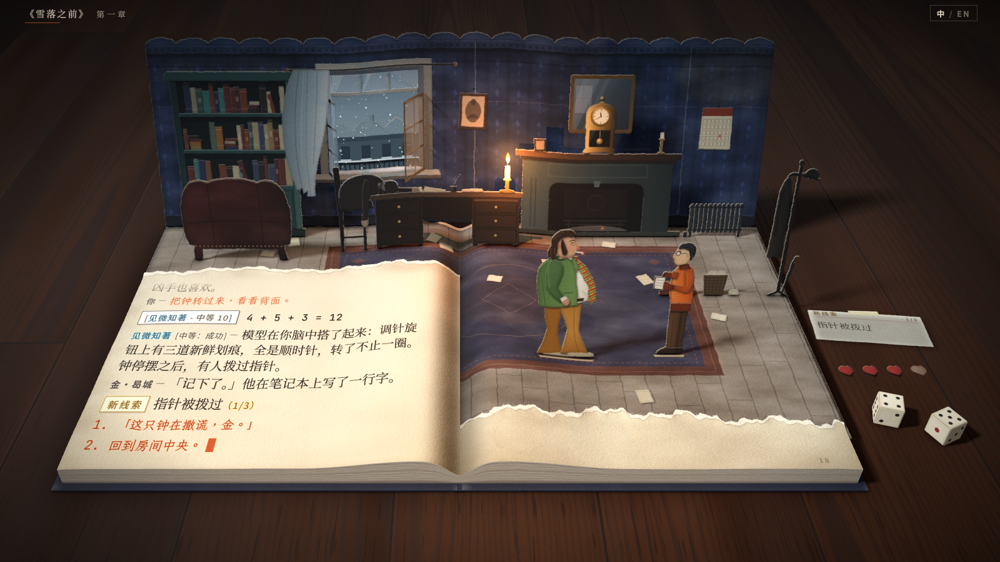

# 相机取景候选

针对第三次打磨后的反馈重新取景：「书本下沿紧贴屏幕下沿，操作起来有点别扭，看起来不像一本放在眼前的书的视角。桌面和书的透视关系看起来也不自然。」本文记录三个候选取景与原取景的参数、构图指标、优缺点和推荐。

## 切换与复现

| 用途 | 方式 |
|---|---|
| 切换取景 | 页面参数 `?view=0`（原取景）、`?view=1`、`?view=2`、`?view=3`；不带参数时为推荐的视角 2。可与其他参数组合，例如 `?still&view=3`、`?lang=en&view=1` |
| 参数位置 | `src/scene/camera.ts` 的 `VIEWS`（每个视角一行，含日志纵向拉伸 `ink` 与木板走向 `boards`），默认视角为 `DEFAULT_VIEW` |
| 对比图 | `npm run shot -- --view 0,1,2,3`：构建后逐个渲染 `?still&view=N`，写 `docs/view-N.png` 并打印构图指标 |
| 其他视角下通关 | `node tools/play.mjs --view N --out <目录>`：按指定视角无头通关，截图写入该目录，不覆盖 `docs/m1-*.png` |

## 参数定义

| 参数 | 含义 |
|---|---|
| `elevation` | 光轴的俯角（度） |
| `focal` | 焦距，单位为画面像素（画面 1600 × 900） |
| `axisY` | 光轴穿过的画面行（镜头移轴）；光轴所在列为 `bookX` |
| `nearEdgeY` | 书尾边中点所在的画面行，其下方是桌面 |
| `nearEdgeWidth` | 13.76 单位宽的书壳在书尾边处占的画面像素，决定相机距离 |
| `bookX` | 书中线所在的画面列（书偏左，右侧桌面放道具） |
| `ink` | 日志字形的纵向拉伸倍数（`src/main.ts` 的 `INK_STRETCH`），抵消斜看纸面造成的压扁 |
| `boards` | 木桌木板走向：`x` 左右，`z` 由近及远 |

眼睛位置由以上参数推出。1 个世界单位约 3 cm；眼高从桌面量起，距离与仰角从书的中心（书脊中点、页面高度）量起。视差范围所有视角相同：左右 3°、上下 1.4°。

## 参数表

| 视角 | elevation | focal | axisY | nearEdgeY | nearEdgeWidth | bookX | ink | boards |
|---|---|---|---|---|---|---|---|---|
| 0 原取景 | 58 | 2600 | 858 | 858 | 1190 | 736 | 1.10 | x |
| 1 稍近 | 48 | 2200 | 450 | 788 | 1190 | 736 | 1.15 | z |
| 2 坐姿（推荐） | 42 | 1700 | 450 | 770 | 1250 | 736 | 1.21 | z |
| 3 前倾 | 38 | 1450 | 450 | 752 | 1325 | 736 | 1.285 | z |

`elevation` 是光轴的俯角。视角 0 的光轴穿过书尾边，视角 1–3 的光轴穿过画面中心，两者的 `elevation` 不能直接比较；比较观看角度时用下表的「从书中心看眼睛的仰角」。

## 构图指标

`?still` 风格板，1600 × 900。字形指标取日志正文（宋体旁白与内心声音）：顶行为淡出区下方第一行完整可见的正文，底行为最后一行正文；高宽比取窗口中部。

| 指标 | 视角 0 | 视角 1 | 视角 2 | 视角 3 |
|---|---|---|---|---|
| 眼高（桌面以上） | 25.9（78 cm） | 21.9（66 cm） | 15.5（47 cm） | 12.1（36 cm） |
| 眼睛到书中心 | 32.1（96 cm） | 27.9（84 cm） | 21.4（64 cm） | 17.9（54 cm） |
| 从书中心看眼睛的仰角 | 52.5° | 50.5° | 45.0° | 40.9° |
| 水平视角（35 mm 等效焦距） | 34°（59 mm） | 40°（50 mm） | 50°（38 mm） | 58°（33 mm） |
| 书壳近边宽 / 远边宽 | 1.13 | 1.20 | 1.30 | 1.39 |
| 书尾边所在行 / 其下桌面 | 857 / 43 px | 787 / 113 px | 769 / 131 px | 750 / 150 px |
| 最后一个选项的中线所在行 | 821 | 751 | 732 | 713 |
| 背景墙顶所在行 | 88 | 59 | 65 | 60 |
| 书壳左缘 / 骰子右缘所在列 | 148 / 1491 | 147 / 1484 | 118 / 1510 | 81 / 1545 |
| 字形高度 顶行–底行（中文） | 15.7–16.8 px | 15.2–17.1 px | 15.3–17.3 px | 15.2–18.0 px |
| 字形高度 顶行–底行（英文） | 15.9–17.1 px | 15.9–17.4 px | 15.4–17.7 px | 15.3–18.4 px |
| 字形高宽比（中文 / 英文） | 0.89 / 0.88 | 0.90 / 0.93 | 0.91 / 0.90 | 0.90 / 0.89 |
| 底行字高 / 顶行字高（中文 / 英文） | 1.07 / 1.08 | 1.12 / 1.10 | 1.13 / 1.15 | 1.19 / 1.20 |
| 日志窗口容纳行数（中文 / 英文，不含淡出区） | 11.6 / 12.4 | 11.1 / 11.8 | 10.5 / 11.1 | 9.8 / 10.4 |

## 共同改动（视角 1–3）

- 光轴穿过画面中心（第 450 行）。原取景的光轴穿过书尾边（第 858 行），画面相当于一张大图的下沿部分；从屏幕正前方观看时，光轴居中的透视与观看方式一致。
- 书尾边离开画面下沿，书前露出桌面，日志选项上移 70–110 像素。
- 木板改为由近及远，板缝与木纹和书的两条侧边汇聚到同一个消失点，桌面随书一起后退。原取景的木板左右走向，板缝是水平线，桌面不提供透视线索。
- 桌面平面从 64 × 40 扩大到 80 × 72，并向远处延伸到 z = −50，低视角时画面上沿仍是桌面。
- 日志纵向拉伸按视角设定，字形高宽比保持在 0.9 左右，顶行字高不低于 15 像素。
- 未改动：灯光、暗角与调色、桌面道具位置（`src/scene/tabletop.ts`）、日志排版（`src/page/`）。选项与悬停提示的拾取、视差、线索卡落下与归档、掷骰、开场翻起、结尾离场、窗外的雪都按相机计算，各视角通用。

## 各视角

### 视角 0：原取景

- 优点：日志窗口行数最多；顶行与底行字高几乎相同。
- 缺点：书尾边距画面下沿 43 像素，选项贴近屏幕下沿；眼高 78 cm、距离 96 cm，接近站立俯看；长焦下书的近大远小不明显（1.13），木板左右走向，书与桌面缺少共同的透视。

### 视角 1：稍近

- 优点：仰角与原取景接近（50.5°），文字观感变化最小；日志窗口只少约 0.5 行；书前露出 113 像素桌面，木板提供透视。
- 缺点：焦距仍偏长（50 mm 等效），近大远小较弱（1.20）；眼高 66 cm，仍高于坐姿；书前桌面在三个候选中最少；墙顶离标题栏最近。

### 视角 2：坐姿（推荐）

- 优点：眼高 47 cm、距书中心 64 cm、仰角 45°，与坐在桌前看一本摊开的书一致；水平视角 50°，约等于在 64 cm 外看 60 cm 宽的画面，透视不夸张；书的近大远小（1.30）与桌面木板的汇聚一致；书前露出 131 像素桌面，最后一个选项距画面下沿约 170 像素；字高 15.3–17.3 像素，底行 / 顶行 1.13。
- 缺点：纵向拉伸增至 1.21，日志窗口比原取景少约 1 行；静帧中完整可见的正文由 6 行减为 5 行。

### 视角 3：前倾

- 优点：书前桌面最多（150 像素）；透视最强（1.39），实物感最明显；选项位置最高。
- 缺点：底行比顶行大约 19%，日志上下字号差异可见；纵向拉伸 1.285，日志窗口比原取景少约 2 行；水平视角 58°，接近广角；书壳左缘距画面左边约 80 像素，视差时更靠边；眼高 36 cm，相当于俯身凑近书页。

## 推荐

默认使用视角 2。理由：

- 同时解决两条反馈：书尾边在第 769 行，书前有桌面，选项离开屏幕下沿；焦距缩短、相机拉近，木板由近及远，书与桌面按同一透视后退。
- 可读性保持：字高 15.3–17.3 像素（原取景 15.7–16.8），高宽比 0.91；上下字号差 13%，低于视角 3 的 19%。
- 视角不过度俯视（仰角 45°，原取景 52.5°），也不像视角 3 那样贴近书页。
- 交接文档第 6 节记录 44° 时文字吃力；纵向拉伸是在改为 58° 时才引入的。视角 2 的字形经拉伸后高宽比 0.91，字高 15 像素以上。

## 待定

- 取景的最终选择。选定后可删除其余视角，或保留 `?view` 作对照；README 与交接文档中的相机描述（58°、`VIEW`、`INK_STRETCH` 1.1）需按选定的视角更新。
- 书前桌面的多少与文字大小相互制约：画面高度固定，书前再多露桌面，需缩小整本书（顶行字高低于 15 像素），或进一步降低视角（纵向拉伸增大、日志行数减少、上下字号差增大）。
- 日志行数：视角越低，保持字形比例所需的纵向拉伸越大，日志窗口容纳的行数越少。视角 2 约少 1 行；如需保持原行数，需缩小日志字号（`src/page/layout.ts` 的 `SIZES`），与文字大小的要求冲突。
